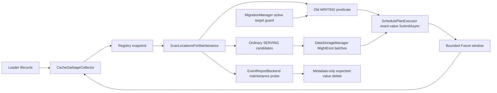

# Cache Garbage Collector 后台扫描 GC 设计

| 项目 | 内容 |
|---|---|
| 状态 | V1 已实现并完成相关单测、E2E 与性能冒烟；基线已包含异步删除（#234）、分层存储迁移（#209）和精确值条件删除（#233） |
| 更新时间 | 2026-09-01 |
| 涉及模块 | `manager`、`meta`、`data_storage`、`config`、`metrics`、`service` |
| 历史参考 | [PR #184](https://github.com/alibaba/tair-kvcache/pull/184) |

本文档定义 Cache Garbage Collector（以下简称 GC）V1 的行为契约和实现边界。PR #184 仅作为历史实现参考；最终行为以本文档和实现为准。

## 1. 背景

### 1.1 为什么需要后台 GC

KVCM 中 Cache Location 的正常生命周期为：

```text
CLS_WRITING -> CLS_SERVING -> CLS_DELETING -> metadata removed
```

当前异常 metadata 主要依赖两类被动触发器清理：

1. 容量达到水位后，由 Reclaimer 采样逐出；
2. key 再次被访问时，通过 `MightExist()` 等检查机会式清理。

如果容量没有达到水位，异常 key 此后也不再被访问，metadata 就可能长期残留。本需求建立一个只在 leader 运行的后台 GC，使 scan view 中可见的长期 WRITING 和存储已明确丢失的普通 SERVING Location 能够主动收敛，并为后续 TTL 等场景提供统一的后台执行入口。

当前 metadata backend 没有按 Location 状态或创建时间查询的索引。V1 不在写入热路径维护新索引，而是按 cursor 分批扫描 maintenance view：dual-backend 模式扫描内存 cache backend，single-backend 模式扫描唯一的 persistent backend。cursor 只把一次扫描摊到多个 tick；在 dual-backend 模式下，已从内存淘汰且未再次加载的冷 metadata 可能不会被发现，这是避免周期性全量扫描 Redis 的显式精度取舍。

V1 采用“以固定间隔扫完一轮，再休眠固定时间”的简单策略。WRITING grace 默认 24 小时，round cooldown 默认 2 小时；两者分别控制删除资格和重复扫描频率。若 active round 的开销仍不可接受，再根据性能数据引入动态 pacing 或到期索引。

### 1.2 当前已知的异常状态

#### 长期 CLS_WRITING

`StartWriteCache` 会把 `CLS_WRITING` Location 写入 metadata，并把 `write_session_id` 保存在当前 leader 的内存中。服务端把 write session timeout 限制为最多 1800 秒；健康 leader 会在 client `FinishWriteCache` 或 timeout callback 中完成状态流转或清理。

如果持有 session 和 timer 的进程在完成前退出，例如 `StartWriteCache` 后发生主备切换，新 leader 无法恢复旧进程内存中的 session：

1. 旧 `write_session_id` 无法继续 Finish；
2. metadata 可能长期停留在 `CLS_WRITING`；
3. 后续写入可能因已有 WRITING Location 而被阻塞；
4. 若没有水位逐出和业务访问，该对象无法自行收敛。

#### 数据已丢失的普通 CLS_SERVING

`CLS_SERVING` 只表示 metadata 已完成写入结算，不保证 URI 对应的物理数据仍然存在。例如 TairMempool 节点退出后，若该 Block 没有再次被访问且容量未触发逐出，失效 metadata 会一直保留。

在线查询已经通过低成本 `MightExist()` 机会式过滤这类 Location。GC V1 复用同一 backend 能力做后台探测：仅当普通 storage 的某个 spec 被明确判定为 missing 时，才把整个 Location 作为候选；backend 不支持低成本探测、返回 unknown、结果 shape 异常或调用失败时均不删除。EventReport 不进入该布尔规则；其扩展在同一个 metadata batch 上调用 Backend 专用的三态判定，详见 [EventReport 主动回收纳入统一后台 GC](event_report_background_gc.md)。

#### 长期 CLS_DELETING

正常删除需要完成状态 CAS、Sync、物理数据删除和最终 metadata CAD。链路中断可能留下长期 `CLS_DELETING`，但仅凭状态和持续时间无法区分：

- 数据尚未释放，可以重试；
- 数据已经释放，只缺最终 CAD；
- URI 空间已经被其他数据复用。

后两种情况下盲目重试物理删除可能造成 UAF。安全恢复依赖 storage URI version/epoch 和后端原子校验，因此长期 DELETING 是已知场景，但不进入 V1。

### 1.3 V1 取舍

V1 处理两类可保守判定的垃圾：超过 grace 且不属于活跃 Migration Copy 目标的 `CLS_WRITING`，以及至少一个 spec 被 `MightExist()` 明确判定为 missing 的普通 `CLS_SERVING`。两类候选复用同一最小闭环：

```text
leader LoopThread
  -> no-touch maintenance batch scan
  -> 固定 WRITING 判定 / 批量 MightExist 探测
  -> 携带扫描快照的条件删除
  -> 复用 SchedulePlanExecutor::SubmitAsync
  -> 记录结果
```

V1 不提前抽象通用 Rule Engine、Candidate Source、Action Dispatcher 或 Admission Controller。两个固定判定仍内聚在 GC 内；扩展点只保留在组件边界上：MetaIndexer 提供无副作用维护扫描，DataStorage 提供低成本保守探测，Executor 提供精确值条件删除。后续规则继续增加时再提取共同接口。

现有 `WriteLocationManager` 的 location ID 隔离问题，以及 Reclaimer 与 `FinishWriteCache` 的结算窗口，是独立的既存正确性问题。它们应单独修复和回归，不作为 GC V1 的依赖，也不在本 PR 顺手改造。

## 2. 设计范围

### 2.1 V1 目标

V1 实现以下六项能力：

1. **低频内存优先巡检**：按 Instance 和 cursor 分批读取 maintenance view；dual-backend 扫描内存 cache backend，single-backend 扫描唯一 backend；每个 tick 最多推进一个 batch，完成一轮后进入 cooldown。
2. **无副作用读取**：GC 扫描不能更新 LRU/access time、hit count、revisit histogram，也不能改变 online hot cache。
3. **保守识别长期 WRITING**：只处理状态、创建时间和标识均明确有效，年龄达到 grace，且不属于活跃 Migration Copy 目标的 Location；异常时间、读取错误或活跃迁移一律跳过。
4. **保守识别普通 SERVING 失效**：按 storage 批量调用低成本 `MightExist()`；任一 spec 明确 missing 时整个 Location 失效，unsupported/unknown/错误均跳过。EventReport 明确排除该规则，但其独立业务判定可复用同一个 scan batch 和统一预算。
5. **异步精确条件删除**：请求携带扫描时的完整 Location 序列化值；Executor worker 重新读取 metadata，只有对象仍与快照完全一致时才执行当前状态到 `CLS_DELETING` 的 CAS。
6. **有界异步反压和 leader 生命周期**：使用小型在途窗口并行消费 Executor 能力；基础 GC 每个 tick 最多提交一个物理删除请求，EventReport 扩展开启时还可提交一个 metadata-only action。达到窗口上限后停止扫描；GC 只在 leader recovery 完成后运行，降级时在 metadata cleanup 前停止并 join。

所有扫描、判定和提交均保持严格的 `instance_id` 隔离。

### 2.2 V1 非目标

以下能力不进入 V1：

1. 通用 Rule/Candidate/Action 框架和动态规则注册。
2. WRITING deadline ZSET、TTL expiry index、CDC 或其他增量候选源。
3. 动态 pacing、adaptive backoff、每轮预算，以及按容量贡献进行跨 Instance 公平逐出；后台扫描仅按 batch 在 Instance 间轮转。
4. 动态或大规模并发窗口、多维 bytes/Group 配额、Future deadline 和持久化任务。
5. `WriteLocationManager` 三元组索引、settling guard，以及 Reclaimer/Finish 竞态修复。
6. `CLS_DELETING` 自动恢复和 storage version/epoch。
7. EventReport reconciliation、Block TTL 和闲置 Instance 清理不属于本文定义的基础 GC V1；其中 EventReport 已作为独立扩展接入同一 round、cursor 和 scan batch，详见 [EventReport 主动回收纳入统一后台 GC](event_report_background_gc.md)。
8. 查询链路 fast-submit 重构。
9. GC lease/generation、跨进程 cursor 或 pending 恢复。
10. data storage I/O timeout/cancel 和 CAS 后补偿状态机。
11. dry-run、动态配置热更新和按 Group/Instance 单独启停。
12. 不改变 #234 的异步删除结果契约：继续复用 accepted、端到端 Future、`PlanExecuteResult`、`EC_PARTIAL_OK` 和 promise exactly-once 完成语义。
13. 不改变 #209 的迁移状态机、Copy 调度和 reservation 生命周期；GC 只消费其活跃目标查询接口。

### 2.3 依赖与交付边界

GC 的 `LoopThread` 回调会同步调用 Registry、maintenance scan 和 DataStorage `MightExist()` 探测，并复用这些组件现有的 timeout 和 retry 语义。公共 Redis command timeout 不是 GC V1 合入或生产启用的硬前置；CacheReclaimer 和其他 metadata 调用方也依赖同一套基础设施。

GC 新增的风险暴露点是：demotion 必须在 cleanup 前 `Join()`，因此慢或失联的 metadata/DataStorage 探测可能延长降级时间。GC 默认关闭，生产上线时应灰度开启并监控扫描错误、共享 Executor/存储后端负载与降级时延；若确认底层调用缺少有限返回上界，应作为公共基础设施问题独立治理。GC V1 不自行重构 Redis 建连、认证、重连、timeout/cancel、连接池或 data storage I/O 语义。

当前基线已包含 #234 的异步删除能力和 #233 的 `expected_location_values` 精确值条件删除。GC 直接复用二者：首次入队 accepted、端到端 Future、Get/CAS/Sync、delay、二次入队、物理删除和 promise 收敛均沿用现有实现。GC 请求额外声明 `authoritative_read`：`PrepareDeleteTaskImpl` 从 persistent source of truth 重新读取扫描目标，条件 CAS 在 shard lock 内先用完整 persistent key 刷新可能缺失或陈旧的 hot cache，再按 expected value 原子复核。普通删除请求不启用该选项，现有同步/异步兼容语义不变。

当前基线也已包含 #209 的分层存储迁移。Migration Copy 会创建合法的 `CLS_WRITING` 目标，并用 `MigrationManager` 活跃任务 reservation 覆盖 Prepare、Copy 和收尾窗口。GC 复用 `HasActiveCopyTargetLocation(instance_id, block_key, location_id)` 排除这些目标；任务结束后若仍留下 WRITING，后续 round 才按普通 orphan 收敛。GC 删除沿用 `kReclaim` 任务类别，不占 migration worker budget，也不修改迁移的队列优先级和并发限制。

## 3. 总体设计

### 3.1 组件与调用链



| 组件 | V1 职责 |
|---|---|
| `CacheGarbageCollector` | 复用公共 `LoopThread` 做单线程调度，维护 round/per-Instance cursor、固定判定、有界 Future 轮询和 pending target 去重 |
| `RegistryManager` | 在每轮开始时提供 Instance Group/Instance 快照 |
| `MetaIndexer` | 从 maintenance scan backend 返回一个无副作用的 metadata batch；dual-backend 优先内存层 |
| `MigrationManager` | 识别仍属于活跃 Copy 的 WRITING 目标，防止被当作 orphan |
| `DataStorageManager` | 按 storage 合并普通 SERVING 的 URI，并通过 `MightExist()` 做低成本保守探测；EventReport 扩展按 Instance/type 路由到专用 Backend 判定 |
| `SchedulePlanExecutor` | accepted 准入和端到端 Future；普通候选在 worker 内执行条件 CAS、Sync、物理删除和最终 CAD，EventReport 扩展在 worker 内执行 token/expected-value 复核与 metadata-only RMW |
| `Server/CacheManager` | 在 leader recovery/demotion 和进程析构时管理 GC 生命周期 |

GC 只访问 data storage 的低成本 `MightExist()` 探测接口，不执行物理删除，也不自行实现 Location 删除状态机。

GC 的扫描协调不放入 `SchedulePlanExecutor`。Executor 是 Reclaimer、GC 等调用方共享的删除执行资源；把 metadata scan/Get 循环放入其中，会占用删除 worker，并把巡检速度与删除吞吐耦合。若扫描任务在 Executor worker 内提交删除后等待 Future，单 worker 配置下还会形成队内自依赖。

因此 V1 只为扫描协调保留一个轻量串行循环，并复用 `common::LoopThread`，不自行实现线程、定时等待和条件变量。GC 找到候选后立即调用 `SchedulePlanExecutor::SubmitAsync()`；Get/CAS/Sync、delay、物理删除和最终 CAD 仍全部由 Executor 执行。

### 3.2 最小运行状态

GC 调度循环只保存：

```cpp
struct ScanState {
    std::vector<InstanceScanEntry> instances;
    size_t instance_index = 0;
    uint64_t round_id = 0;
    std::optional<std::chrono::steady_clock::time_point> next_round_at;
};

struct InstanceScanEntry {
    std::string instance_group;
    std::string instance_id;
    std::string cursor = SCAN_BASE_CURSOR;
    bool completed = false;
};

struct InflightDelete {
    uint64_t round_id = 0;
    std::string instance_id;
    std::string action_name;
    size_t target_count = 0;
    std::chrono::steady_clock::time_point submitted_at;
    std::vector<PendingLocationKey> pending_locations;
    std::future<PlanExecuteResult> future;
};

std::vector<InflightDelete> inflight_deletes;
std::set<PendingLocationKey> pending_locations;
```

`PendingLocationKey` 至少包含 `(instance_id, block_key, location_id)`。在途窗口和 pending 集合只由 `LoopThread` 回调访问，其规模分别受 `max_inflight_delete_requests` 和 `max_inflight_delete_requests * scan_batch_size` 约束。跨线程只保留 GC stop 标志和一个 `LoopThread` handle，不维护自建 condition variable 或通用 task table。

每次 leader recovery 后重新开始一个 round；降级、重启或重新成为 leader 时不恢复旧 cursor。重复覆盖由条件 CAS 保证安全。

### 3.3 LoopThread 回调

`LoopThread` 使用 strict interval，在上一次回调结束后至少等待 `scan_interval_ms`，因此慢调用返回后不会追赶错过的 tick。每个回调按以下顺序执行：

1. 若收到 stop 请求，立即退出；若持有未完成 Future，只丢弃本地 handle 和 pending，不取消或等待底层 Executor 任务。已接受任务在 leader cleanup 期间按 best-effort 语义继续执行。
2. 非阻塞轮询全部在途 Future：ready/exception/invalid 均记录结果、释放其 pending target 并移出窗口；未 ready 的任务继续占用槽位。
3. 若在途请求数已达到 `max_inflight_delete_requests`，本 tick 结束，不继续扫描。
4. 若仍处于 round cooldown，本 tick 结束。
5. 若没有本轮快照，从 Registry 获取 Group/Instance 列表，按 `(instance_group, instance_id)` 排序；失败时按普通 tick 间隔重试。
6. 对当前 Instance 调用一次 `ScanLocationsForMaintenance(entry.cursor, scan_batch_size)`。
7. 保存该 Instance 的 next cursor，遍历返回的 Location：筛选长期 WRITING 并排除活跃 Migration Copy 目标；对普通 SERVING 的合法 URI 按 `(storage unique name, storage type)` 聚合，每次最多取 512 个 URI 调用 `MightExist()`；每个探测分块前后检查 stop。EventReport 扩展开启时在同一 batch 调用其专用三态 probe；所有不确定结果均跳过。
8. 候选按 `(block_key, location_id)` 去重并统一排序，Location 总数最多为 `scan_batch_size`。EventReport 扩展另按唯一 Block key 限制 metadata action；请求为空时不调用 Executor。
9. 普通候选和 EventReport 候选分别构造物理删除请求与 metadata-only 请求，并调用对应 `SubmitAsync()`。物理删除优先，因此一个 tick 最多提交两个请求，且不会超过剩余 inflight 槽位：
   - `accepted=true` 且 Future valid：保存 Future，并为最终请求建立 pending target；
   - `accepted=false`：视为正常入队反压，不建立 Future 或 pending；
   - accepted/Future 契约不一致：记录 `submit_contract`，不建立本地状态；
   - 调用抛异常：记录 `submit_exception`，不建立本地状态。
10. 无论当前 cursor 是否回到 base，下一 tick 都轮转到下一个未完成 Instance；当前 Instance 回到 base 时将其标记完成。单个 Instance 在同一 round 内连续 3 次 Scan 失败后也标记为本轮完成，剩余 keyspace 延迟到下一 round 从 base cursor 重试，避免一个故障 Instance 永久卡住其他 Instance 和 Registry 新快照。全部 Instance 完成后结束 round，并设置 `next_round_at = now + round_pause_ms`。
11. tick 结束后至少等待 `scan_interval_ms`。慢调用返回后不追赶错过的 tick。

窗口默认包含 2 个请求。一个慢或卡住的物理删除或 metadata action 只占用一个槽位，其他槽位仍可继续扫描和提交；只有全部槽位被占用时才暂停扫描。这为当前无容量上限的 Executor 队列提供 GC 调用方侧的硬反压，同时利用 #234 已提供的 worker 并发。基础 GC 每 tick 最多提交一个物理删除；EventReport 扩展开启时，同一批最多再提交一个 metadata action。`inflight_delete_count` 和 `inflight_delete_age_ms` 分别表示当前 GC 在途 action 数和最老任务年龄。

cursor 在 SubmitAsync 前已经推进。rejected、抛异常或 accepted/Future 契约错误时不回滚 cursor，也不保存该批候选；对象仍保留在 metadata 中。若它后续仍可从 maintenance view 观察到，则由后续 round 重新发现；dual-backend 下已被内存淘汰的对象不承诺仅靠 GC 主动重载。这样避免为 V1 引入额外 retry queue。

同一 batch 中超过 target 上限的候选不会保存在额外 pending 表中；它们仍留在 metadata 中，并在仍可见于 maintenance view 时由后续 round 再次发现。这会牺牲极端场景的收敛速度，但保持 V1 状态简单。

### 3.4 Maintenance scan 语义和成本

一个 round 只在开始时获取一次 Registry 快照。每个 Instance 保存独立 cursor；调度器每个 tick 只推进一个 batch，随后轮转到下一个未完成 Instance，直到全部 cursor 回到 base。快照之后新增或删除的 Instance 允许本轮不可见或返回 Indexer 不存在，下一轮重新获取快照后收敛。

Redis SCAN（single-backend）和本地 backend cursor（dual-backend）都不提供并发 exactly-once：

- 同一 key 在一轮中可能重复；
- 并发删除或索引移动可能使本轮漏过 key；
- 并发新增 key 可能到下一轮才被看到。

V1 只要求重复处理安全；仍存在于 scan view 的对象可由后续 round 重新覆盖。扫描发现不是删除授权：普通物理删除由 Executor 的 authoritative read 和完整 Location 条件 CAS 决定；EventReport 扩展由 worker 内的 Backend token/lease 与 no-touch expected-value RMW 决定。

设 scan view 中某 Instance 有 `N` 个 Block、平均每个 Block 有 `L` 个 Location，则一轮判定成本约为 `O(N + N*L)`。dual-backend 的 `N` 是当前内存 cache 中可见的 key 数，不是 persistent keyspace；`scan_batch_size` 是 backend hint，不保证 Local backend 的单 shard 返回量严格受限。

设 active round 耗时为 `S`、cooldown 为 `P`，正常候选的最坏发现时间约为：

```text
candidate eligibility delay + S + P
```

WRITING 的 eligibility delay 是 grace；普通 SERVING storage-missing 一旦进入扫描即具备资格。默认 WRITING grace 为 24 小时，`P` 为 2 小时，因此该能力定位为 best-effort 后台收敛，不提供分钟级 SLA。cursor 并发遗漏、target 裁剪、backend/探测错误、全部在途槽位卡住，以及 dual-backend 下目标已从内存淘汰，都可能继续延长时间；最后一种情况不承诺有限时间内仅靠 GC 收敛。

## 4. 详细设计

### 4.1 无副作用、内存优先的 maintenance scan

GC 不能直接复用在线 `GetLocations()`：

- Local/Dummy backend 的读取会更新 LRU 或 revisit 统计；
- 在线读取还可能在 cache miss 时回填完整 key，改变 hot cache 内容。

V1 对 GC 暴露一个合并的维护接口，避免 GC 自己拼接 List 和 Get：

```cpp
struct MaintenanceScanBatch {
    std::string next_cursor;
    KeyVector keys;
    CacheLocationMapVector locations;
    std::vector<ErrorCode> location_results;
};

ErrorCode MetaIndexer::ScanLocationsForMaintenance(
    RequestContext *request_context,
    const std::string &cursor,
    size_t limit,
    MaintenanceScanBatch &out) noexcept;
```

接口契约：

1. dual-backend 模式从内存 cache backend 读取 key 和 Location；single-backend 模式从唯一 persistent backend 读取。
2. 读取不更新 access/LRU/revisit，也不从 persistent backend 回填 hot cache。
3. `keys`、`locations` 和 `location_results` 必须按下标对齐；shape 不一致视为整批错误，不做删除。
4. Scan 级错误时不推进 cursor，并先轮转其他 Instance；同一 Instance 本轮连续 3 次失败后跳过本轮，下一 round 从 base cursor 重试。单 key 已不存在或读取失败时跳过该 key，cursor 正常推进，由下一轮再覆盖。
5. `limit` 只作为 backend hint；调用方不能假设实际数量一定不超过该值。

实现上，该契约下沉到 backend 的合并扫描接口。Local cache 在底层容器中直接复制 Location，不调用在线 `Lookup/Touch`；Redis/AsyncRedis 的 `SCAN` 只用于没有 cache backend 的 single-backend 部署。backend manager 在 dual-backend 模式下选择 cache backend 扫描，不因 miss 回填 persistent；在线读取接口保持不变。普通物理删除仍执行 authoritative revalidation；EventReport metadata action 在执行时 no-touch 对比 hot 与 persistent target，两侧值冲突则 fail-closed，也不会把 persistent 结果回填 hot cache。

正常配置与 recovery 完成后，内存层应覆盖 GC 需要巡检的 metadata；但该完整性是运行期预期，不作为删除框架的强契约。这一选择降低了周期扫描 Redis 的常态成本，同时接受 dual-backend 下对 persistent keyspace 覆盖不完整：内存层未加载或已淘汰的冷 key 本轮不可见。GC 对这类对象只提供 best-effort 清理；后续业务访问、恢复或其他机制使其重新进入内存后，后续 round 才可能发现。

### 4.2 长期 orphan WRITING 判定

Location 同时满足以下条件才进入请求：

1. `status == CLS_WRITING`；
2. `instance_id`、`block_key` 和 `location_id` 均有效；
3. `create_time` 可解析，且不晚于当前时间；
4. `now - create_time >= orphan_writing_grace_period`。
5. `MigrationManager::HasActiveCopyTargetLocation(instance_id, block_key, location_id) == false`。

任一条件不确定都 fail-closed 跳过，不尝试删除。V1 不逐 Location 记录拒绝原因，避免全量扫描制造高基数指标和日志；只对 batch shape、backend 读取等操作异常计数。

`create_time` 使用现有微秒时间戳。实现先判断 `now_us >= create_time`，再用有符号或检查过的 duration 计算 age，不能用无符号减法掩盖时钟回拨。

V1 不查询 `WriteLocationManager`。理由是：

- 服务端 write session 硬上限为 30 分钟；
- grace 最小为 1 小时，在 write session 硬上限之外保留 30 分钟安全余量；生产默认仍为 24 小时；
- 在健康进程中，超过 session 上限的 WRITING 已不再是合法活跃写入；
- HA 后旧 session 本来也不在新 leader 的内存中；
- 扫描后的并发 Finish 由最终条件 CAS 保护。

上述推论只适用于 client write session。#209 的 Migration Copy 也会创建 `CLS_WRITING`，其合法生命周期不受 30 分钟 write-session 上限约束，因此必须额外查询活跃 Copy reservation。该查询按 `(instance_id, block_key, location_id)` 隔离；Prepare 尚未绑定 location ID 时，#209 已定义为临时保护该 block 的 WRITING 目标。GC 不复制这套状态，只消费查询结果。

1 小时下限用于覆盖 write-session timeout 轮询、正常调度抖动和 AsyncRedis 的正常异步刷写窗口；若 metadata 异步写入超过 30 分钟仍未收敛，视为公共 backend 一致性故障，GC V1 不增加专用 `Sync/fence`。24 小时默认值不是为了容纳合法慢写，而是第一版自动删除路径的保守爆炸半径，为监控和人工干预留出更充足时间。

`create_time` 和 GC 的 `now` 可能来自不同机器的 wall clock。V1 假设集群 NTP 正常，秒级偏差相对至少 1 小时的 grace 可接受；时间回拨或未来时间一律跳过。若后续需要消除该假设，应让创建和判断使用同一个 authoritative time source。

### 4.3 普通 SERVING 的 storage-missing 判定

GC 的普通规则只探测 `status == CLS_SERVING` 且 storage type 已知的普通 Location，明确排除 EventReport。每个 scan batch 内先解析 Location spec URI，再按 `(storage unique name, storage type)` 聚合。调用前确认该 storage 仍已注册且 backend type 与 Location 一致；随后按最多 512 个 URI 分块调用 `MightExist()`，限制一次调用和 `DataStorageManager` 共享锁的持有范围。一个 Location 的多个 spec 可以分布在不同分块，结果按原下标映射回 Location。EventReport 扩展不复用该布尔判定，但消费同一个 `MaintenanceScanBatch`。

`MightExist()` 的契约是低延迟且允许 false positive：backend 无法低成本或确定判断时返回 `true`，`false` 必须表示明确 missing。GC 的判定为：

- 任一可解析 spec 返回 `false`：整个 Location 失效；
- 全部返回 `true`：保留；其中可以包含 backend 的 unknown/unsupported；
- URI 无法解析、storage 不存在、结果长度不匹配或调用抛异常：该部分视为 unknown，不单独授权删除；若同一 Location 的其他 spec 被明确判定 missing，仍可判为失效；
- 没有任何可探测 spec：跳过。

storage 未注册记录 `might_exist_storage_not_found`，backend type 不一致记录 `might_exist_storage_type_mismatch`；两者均视为 unknown，不调用探测。结果长度必须与当前分块的输入 URI 数完全一致，否则该分块结果不可关联，记录 `might_exist_shape` 并丢弃；其他分块和 storage 继续。调用异常记录 `might_exist_exception`，不影响同 batch 的其他 storage。GC 不逐 URI 输出正常 missing 日志，避免全量扫描制造日志压力。

该规则删除整个 Location，而不是只删 missing spec。原因是一个 Location 的 specs 共同描述同一份可用缓存，任一必需 spec 丢失后该 Location 已无法完整服务；Executor 仍会 best effort 删除其余 URI，再完成 metadata CAD。NFS/HF3FS 等未覆写 `MightExist()` 的 backend 默认返回全 `true`，因此不会因为 GC 引入同步 I/O 或误删；具备低成本明确判定能力的 backend 才实际启用该规则。

storage-missing 往往由节点批量退出触发，可能在短时间产生大量物理删除。任务会进入与 Reclaimer 共享的 Executor；如果后端 `Delete()` 缺少 I/O timeout，大量慢删除可能占用共享 worker，并通过 `DataStorageManager` 锁竞争延长 storage cleanup。V1 不能改为 metadata-only：同一 Location 的其他 spec 可能仍存在，需要 best effort 释放。上线需按 Instance/Group 灰度，重点监控在途任务年龄、Executor/存储后端负载和 demotion 时延；物理 I/O timeout/cancel 与独立执行隔离仍是后续公共治理项。

### 4.4 精确值条件化 Location 删除

扫描结果只负责发现，不能直接授权删除。当前基线的 `CacheLocationDelRequest` 已提供与 `location_ids` 平行的可选快照值：

```cpp
struct CacheLocationDelRequest {
    std::string instance_id;
    std::vector<int64_t> block_keys;
    std::vector<std::vector<std::string>> location_ids;
    std::chrono::microseconds delay{std::chrono::seconds(0)};
    std::vector<std::vector<std::string>> expected_location_values;
    bool metadata_only{false};
    bool authoritative_read{false};
};
```

GC 对 WRITING 和 SERVING 两类 target 都设置扫描时的 `CacheLocation::ToJsonString()`，普通 storage 删除保持 `metadata_only=false`，并设置 `authoritative_read=true`。Executor 对每个 target：

1. 从 persistent backend 重新读取当前 Location，不以 dual-backend 的 hot-cache 命中为删除前提；
2. Location 不存在，或完整序列化值与扫描快照不一致时跳过；
3. 条件 CAS 持有 MetaIndexer shard lock 后，从 persistent backend 重新读取完整 key 并刷新 hot cache，避免 cache miss/stale 令 target 永久 no-op，也避免只回填单个 Location 隐藏同 Block 的其他字段；
4. 构造“当前状态和完整 expected value -> `CLS_DELETING`”的条件 CAS；
5. 只把 CAS 成功的精确子集交给现有 Sync、物理删除和 metadata CAD。

如果并发 `FinishWriteCache` 已把 WRITING 改为 SERVING，或 SERVING 的 URI、create time 等字段被刷新，完整值比较会失败；如果 Reclaimer 同时提交同一 target，也只有一个 CAS winner。精确值条件比单独的 `expected_status` 更强，并允许一个请求同时包含 WRITING 与 SERVING 候选。

未设置 `expected_location_values`、未启用 `authoritative_read` 的现有调用方保持当前行为。authoritative read 只在候选 admission/CAS 阶段触碰被选中的完整 key；maintenance scan 本身不从 persistent 回填 hot cache。V1 不新增 GC 专用删除状态机，也不改变物理删除和最终 CAD 的顺序。

#234 的 `SubmitAsync()` 首次入队成功后立即返回；Get/CAS/Sync、delay 和物理删除都在 Executor 中完成。精确值筛选和 CAS 已由 #233 落在共享 `PrepareDeleteTaskImpl`/MetaSearcher RMW 中，同步与异步入口复用同一 admission 语义。

### 4.5 有界 Future 窗口、pending 去重和结果

GC 同一时刻最多持有 `max_inflight_delete_requests` 个已接受请求的 `std::future<PlanExecuteResult>`：

- `SubmitAsync()` 只有返回 `accepted=true` 且 valid Future 时才保存 Future，并建立最终请求对应的 pending target；
- `accepted=false`、invalid Future、accepted/Future 契约不一致或抛异常均不建立 Future、pending 或其他本地状态；
- 每个 tick 先非阻塞轮询全部 Future，终态或异常只释放该任务的槽位和 pending；
- 未 ready 的 Future 继续占用槽位，但只在窗口全部占满时停止后续 Scan 和 Submit；
- pending key 包含 `instance_id`，相同 block/location 在不同 Instance 中互不影响；
- 空请求不进入 Executor。

pending 集合不承担删除授权，只用于覆盖请求 accepted 到 Executor 执行前的窗口，以及 backend cursor 可能在同一 round 重复返回 key 的情况。普通物理删除最终由完整 expected value 条件 CAS 仲裁；EventReport metadata action 则由 worker 内的 Backend token/lease 和 expected-value RMW 仲裁。窗口和单请求 target 上限共同限定 pending 集合大小，不新增 bytes credit、deadline 或跨进程恢复。

V1 沿用现有 `PlanExecuteResult` 语义，不新增 PARTIAL 或 per-target result：

- `EC_OK`：任务按现有 Executor 语义完成，也可能表示 target 已不存在或条件不匹配而 no-op；
- `EC_PARTIAL_OK`：物理删除或 metadata CAD 仅部分成功，是明确终态；记录结果并释放对应槽位；
- 其他 ErrorCode：删除链路明确失败，记录 `delete_result_count{status}`，并输出包含 round、Instance、target 数和错误信息的 warning；
- Future exception/invalid：Executor contract error。

GC 不因单次失败停止后续 round，也不自动重试同一请求。仍满足 WRITING、storage-missing 或 EventReport Backend 判定，且仍可见于 maintenance view 的对象由后续 round 再次发现；已经进入 DELETING 的物理删除失败对象留给未来 DELETING reconciliation 处理。EventReport action 不进入 DELETING。

## 5. 生命周期与并发

### 5.1 启动和重复调用

- `enabled=false`：不创建 GC `LoopThread`。
- `enabled=true`：只构造 GC；首次 leader recovery 成功后调用 `Start()`。
- `Start()` 在 `LoopThread` 已运行时幂等；线程已 join 后再次调用会创建新的 `LoopThread`、清空旧 cursor，并从新 round 开始。
- `RequestStop()` 和 `Join()` 均幂等。
- `enabled=true` 时配置非法或构造依赖缺失，服务初始化失败，不静默降级为 disabled；`enabled=false` 时不校验未使用的 GC 运行参数。
- leader promotion 时线程创建失败，`Start()` 返回错误，本轮不 Resume Reclaimer、也不开放 leader-only 请求。
- 某个 Instance 的 Indexer 尚未 recover 时，本轮跳过并告警，由下一轮覆盖，不让整个服务退出。

### 5.2 Leader recovery 和 demotion

升主顺序：

```text
RegistryManager::DoRecover()
  -> CacheManager::DoRecover()
  -> CacheGarbageCollector::Start()
  -> Reclaimer.Resume()
  -> MigrationManager.Start()
  -> enable leader-only requests
```

降级采用“先发停止信号，后 join”的顺序：

```text
GC.RequestStop() + Reclaimer.Pause()
  -> DisableLeaderOnlyRequests()
  -> WaitForAllLeaderOnlyRequestsToComplete()
  -> GC.Join()
  -> MigrationManager.Stop()
  -> CacheManager::DoCleanup()
  -> RegistryManager::DoCleanup()
```

`RequestStop()` 只设置 GC stop 标志，并调用 `LoopThread::RunOnce()` 唤醒可能处于 tick/cooldown 等待的循环；回调看到 stop 后立即返回。该操作不 join，不能在关闭 leader 请求之前阻塞。`Join()` 随后调用 `LoopThread::Stop()` 完成 join，且必须位于 MigrationManager Stop 和 CacheManager/Registry cleanup 之前，保证 GC 不再读取活跃 Copy reservation 或其他依赖。V1 不修改公共 `LoopThread` 接口。

`LoopThread` 回调在每次 Registry、Scan、DataStorage 探测分块和 SubmitAsync 前检查 stop，并在每个普通或 EventReport probe 分块返回后再次检查。已经进入的 Registry/Scan/probe 同步调用不能强制取消，`Join()` 会沿用底层现有 timeout/retry 语义，慢调用可能相应延长 demotion。Executor admission 已异步化，不阻塞 GC 的 `Join()`；GC 在 stop 时只丢弃本地 Future handle 和 pending 集合，不等待端到端 action Future。`Join()` 只保证扫描回调不再访问 Registry、MetaIndexerManager、DataStorageManager 等依赖，不为已接受 action 建立 drain 屏障。

降级时若 GC 已提交 action，只丢弃本地 Future handle，不取消 Executor 中的任务。普通删除与 Reclaimer 已提交任务使用相同的 best-effort detach 语义：cleanup 前完成则正常收敛；若已完成进入 `CLS_DELETING` 的 CAS，但后续依赖已被 cleanup，则 Future 可能以错误终态结束并留下长期 `CLS_DELETING`。EventReport action 在 worker 中重新校验 Backend/token 和 expected value；依赖已拆除时失败退出，不产生物理删除。V1 不引入统一 Executor drain、跨 leader generation 或 DELETING 补偿；这些能力作为独立生命周期治理工作处理。

### 5.3 进程停止和析构

`CacheManager` 析构时首先停止并 join GC，再拆除 Registry、MetaIndexer、Executor、metrics 等 GC 依赖。当前未引入 GC 时的 WLM/Reclaimer shared ownership 顺序不是既存 UAF；本设计不借 GC PR 重排无关组件。

Stop 通过 GC stop flag、`LoopThread::RunOnce()` 和最终 `LoopThread::Stop()` 打断 tick sleep 与 round cooldown。若回调正在 Registry/metadata/DataStorage 同步调用中，`Stop()` 需要等待当前调用按底层现有 timeout/retry 语义返回；返回后不会继续下一个探测分块。若底层缺少有限返回上界，进程停止或 demotion 可能被延长。

## 6. 异常处理

| 场景 | V1 行为 |
|---|---|
| Registry snapshot 失败 | 丢弃不完整快照，普通 tick 后重试 |
| Instance/Indexer 不存在 | 跳过当前 Instance，下一轮重新发现 |
| Scan 失败 | 不推进 cursor并轮转其他 Instance；单 Instance 本轮连续 3 次失败后跳过本轮，下一 round 从 base cursor 重试 |
| key 在 SCAN 后被并发删除（`EC_NOENT`） | 正常跳过，不计入 operation error |
| 单 key Location 读取失败 | 跳过该 key、记录 `scan_key` error，下一轮覆盖 |
| batch shape 不一致 | 整批拒绝，不提交 |
| Location 字段或时间非法 | fail-closed 跳过 |
| Location 是活跃 Migration Copy 目标 | 正常跳过；任务释放 reservation 后，若仍为 WRITING 则由后续 round 重新判断 |
| EventReport SERVING | 不进入普通 storage-missing 规则；扩展开启时由同一 scan batch 调用 EventReportBackend 三态判定 |
| URI 无法解析或无可探测 spec | 视为 unknown，单独不授权删除 |
| storage 未注册 | 视为 unknown，不调用探测，记录 `might_exist_storage_not_found` |
| backend type 与 Location 不一致 | 视为 unknown，不调用探测，记录 `might_exist_storage_type_mismatch` |
| `MightExist()` 返回长度不一致 | 丢弃当前 URI 分块结果，记录 `might_exist_shape`；其他分块继续 |
| `MightExist()` 抛异常 | 当前及后续分块视为 unknown，记录 `might_exist_exception`；已完成分块的明确结果保留，其他 storage 继续 |
| 空候选 | 不调用 Executor |
| SubmitAsync rejected | 视为正常入队反压，不占槽位、不建立 pending；cursor 不回滚，后续 round 重新发现 |
| SubmitAsync 直接抛异常 | 记录 `submit_exception` error，不占槽位、不建立 pending；cursor 不回滚 |
| accepted/Future 不一致 | 记录 `submit_contract` error，不占槽位、不建立 pending；cursor 不回滚 |
| 条件不匹配或 CAS loser | 合法 no-op，不告警为数据错误 |
| Future 返回错误 | 释放对应槽位和 pending、记录结果，后续 round 继续 |
| Future 长期未完成 | 保留其槽位和 pending、持续上报最老 age；其他槽位仍可推进，V1 不超时释放 |
| stop 期间存在 Future | 丢弃本地 handle 和 pending，不取消或等待底层任务；任务 best effort 继续，普通删除 CAS 后失败可能留下 `CLS_DELETING`，EventReport action 仍需 worker 复核 |

所有错误路径都必须经过 `scan_interval_ms` 或 cooldown，不能形成零间隔重试。

## 7. 可观测性

V1 只保留能回答“是否在扫描、发现了什么、删除是否卡住”的核心指标：

| 指标 | 类型 | 说明 |
|---|---|---|
| `cache_gc.scan_round_count` | Counter | 完整 round 完成次数 |
| `cache_gc.scan_key_count` | Counter | 扫描 Block 数 |
| `cache_gc.candidate_count{reason}` | Counter | 候选数；基础 V1 reason 为 `orphan_writing` 或 `storage_missing`，EventReport 扩展增加其业务原因 |
| `cache_gc.delete_target_count` | Counter | 实际提交的 Location 数 |
| `cache_gc.delete_result_count{status}` | Counter | Future 终态 |
| `cache_gc.operation_error_count{stage}` | Counter | Registry/scan/submit/future 等异常；并发 `EC_NOENT`、条件不匹配和 CAS loser 不计入 |
| `cache_gc.inflight_delete_count` | Gauge | 当前在途删除请求数 |
| `cache_gc.inflight_delete_age_ms` | Gauge | 最老在途 Future 的年龄，无任务时为 0 |
| `cache_gc.round_duration_ms` | Gauge | 最近一个 active round 耗时 |

round 和结果日志包含 `round_id`、`instance_id`、target 数、result；扫描错误日志额外包含 cursor 和 error stage。正常逐 key 扫描不打 INFO，block/location 明细只在诊断级日志中输出，避免 GC 自身制造日志压力。

上述固定指标和带 `reason/status/stage` 标签的指标族同时进入本地 registry、Prometheus 和 KMonitor；KMonitor 周期上报直接遍历 registry 中已 touched 的 series，避免另维护一份易遗漏的标签枚举。

## 8. 测试方案

### 8.1 单元测试

1. disabled 不创建 `LoopThread`；Start/RequestStop/Join 重复调用安全，重新 Start 从 base cursor 开始。
2. 每个 tick 最多调用一次 Scan；cursor、Instance 推进和 round cooldown 正确。
3. Registry/Scan 失败按普通间隔重试，不推进错误 cursor，也不零间隔空转；单 Instance 重试耗尽不会阻塞 round 完成和后续 Registry 快照。
4. maintenance scan 在 dual-backend 下只读取 cache backend，不回退 persistent；persistent-only key 不会被本轮发现，single-backend 则扫描唯一 backend。
5. Local/Dummy maintenance scan 不改变 LRU/access/revisit；扫描不会触发 persistent-to-cache 回填。普通物理删除候选仍由 Executor authoritative re-read 后条件删除；EventReport 候选在 worker 中执行 no-touch expected-value RMW。
6. 只有状态为 WRITING、字段有效且年龄达到 grace 的 Location 成为 orphan 候选；未来时间、解析失败和边界值 fail-closed。
7. grace 配置不得小于 1 小时，默认值为 24 小时。
8. 普通 SERVING 按 storage 批量探测，任一 spec 明确 missing 时选择整个 Location；全 true、无可探测 URI、storage 缺失/type 不符、shape 错误和异常均 fail-closed，EventReport 不进入该布尔规则；单次探测不超过 512 URI。扩展测试另验证 EventReport 与普通候选共享同一次 scan。
9. 请求保持 Instance 隔离，按 `(block_key, location_id)` 去重并受 Location 总预算约束；EventReport action 另受唯一 Block key 预算约束，空请求不调用 Executor。
10. GC 请求携带与 target 平行的完整序列化 Location；请求排队后 Finish、URI 刷新、DELETING 或 NOENT 均因 expected value 不匹配而不做物理删除。
11. #209 活跃 Copy reservation 对应的 WRITING 目标不会成为候选；相同 location ID 在其他 Instance/Block 中不被误保护。
12. GC 与另一个删除者同时提交同一 target 时只有一个 CAS winner。
13. 普通删除与 EventReport action 共用有界窗口；窗口未满时一个慢 Future 不阻止其他 batch 提交，窗口占满后停止 Scan；Future 终态只释放自己的槽位和 pending，随后恢复扫描。
14. RequestStop 能打断 sleep/cooldown，并在当前 DataStorage 探测分块返回后停止后续分块；活跃 maintenance scan 或探测返回前 Join 必须等待，未完成删除 Future 不参与 GC drain 并按 best-effort detach；CacheManager cleanup 会先停止 GC 扫描线程。
15. 未设置 `expected_location_values`、未启用 `authoritative_read` 的现有 Executor 调用方行为不变。
16. 并发删除导致的 `EC_NOENT` 不增加 operation error；SubmitAsync 直接抛异常归入 `submit_exception` 而不是 `tick_exception`。
17. accepted 到 worker 执行期间同一 Instance 的相同 target 被 pending 过滤；不同 Instance 的相同 block/location 不互相抑制；rejected、invalid 和空请求不留下 pending。

测试使用注入时钟或回填旧 `create_time`，不通过放宽生产 grace 下限制造并发窗口。

### 8.2 集成测试

集成测试覆盖以下组合和场景：

1. KVCM + Dummy metadata + NFS data storage：模拟进程重启后 session 丢失，回填超过 grace 的 WRITING，确认删除链路完成 metadata 清理，Block 可再次写入。
2. 同一 Group 多 Instance 中，未到 grace 的 WRITING 不删除，只有过期 Instance 被处理。
3. cached metadata 模式下，recovery/业务加载后已进入内存的 orphan 可被 GC 发现并清理；cache-only scan、persistent miss 不回填和 LRU 不变由 backend component test 单独验证。
4. GC 开启期间执行真实 leader demotion，确认进程健康进入 standby，cleanup 完成后 scan round 不再增长。
5. KVCM + Dummy metadata + Dummy data storage：完成 SERVING 后移除物理文件，不发起 Get，确认后台 `MightExist()` 发现并清理 metadata，Block 可再次写入。

并发 Finish、真实 Executor backlog、慢 admission 和 Join 等需要精确控制时序的场景在 C++ component test 中验证，避免依赖不稳定的 wall-clock 或外部故障注入。

NFS 只用于验证物理删除控制链路；Dummy 持久化文件用于构造和验证 metadata 最终清理。

### 8.3 性能测试方法

采用 matched A/B 和分层负载验证：

1. 固定 binary、资源配额、keyspace、请求序列、目标 QPS、运行时长和随机种子，对比 GC disabled、GC enabled 但处于 cooldown，以及 GC enabled 且 active scan 三种场景；轮换执行顺序并重复运行，降低缓存预热和系统抖动影响。
2. 分别构造无垃圾、少量/大量 orphan WRITING 和普通 SERVING，区分纯扫描、`MightExist()` 探测、候选判定和实际删除成本；对具备真实低成本探测的 backend 单独统计探测开销。
3. 逐级扩大 keyspace，并组合不同 `scan_batch_size`、`scan_interval_ms`，观察 active round 的扫描吞吐和在线请求退化趋势。
4. 让慢物理删除分别占用一个和全部在途槽位，验证部分槽位被占用时仍可推进、窗口满时停止扫描的反压行为。

比较在线 Get/StartWrite/FinishWrite P50/P95/P99、内存 cache 扫描 CPU/锁等待、候选 action 产生的 Redis QPS/CPU/网络流量、KVCM CPU/RSS、active round 时长、每秒扫描 key 数和垃圾收敛时间，同时确认业务请求无新增失败、active-scan 场景确实产生扫描量。测试结果用于判断默认 batch/interval 是否可接受，以及 V2 是否需要动态 pacing、提升 persistent 覆盖率或引入索引化候选源。

## 9. 验收标准

1. disabled、standby 和 leader recovery 完成前不扫描、不提交。
2. GC 能对选定的 maintenance backend 完成一轮 cursor 覆盖；dual-backend 只扫描 cache、single-backend 扫描唯一 backend，且扫描不改变业务访问统计。
3. grace 最小 1 小时、默认 24 小时，在 30 分钟 write session 上限之外保留安全余量；判定异常时 fail-closed。
4. 只有长期且不属于活跃 Migration Copy 的 WRITING，或被 backend 明确判定至少一个 spec missing 的普通 SERVING 进入物理删除请求；不确定探测结果不会删除。EventReport 只有 Backend 返回明确 `DeleteMetadata` 时才产生 metadata-only action。
5. 并发 Finish、Location 刷新、Reclaimer 或重复 SCAN 由完整 expected Location value 的条件 CAS 安全仲裁。
6. 普通删除和 EventReport metadata action 的 GC 在途总数不超过配置上限；单个慢任务不会暂停整个 GC，全部槽位占满时形成硬反压，空请求和错误不会形成提交风暴或 CPU 空转。
7. 每轮完成后至少等待 `round_pause_ms`，不会持续重复全扫。
8. demotion 时先停止新 leader 请求，再在 cleanup 前完成 GC 扫描线程 join；慢 maintenance metadata/DataStorage 探测可以延长 join。已接受的普通删除和 EventReport action 不参与 GC drain，但仍可能因共享 worker 或依赖竞争间接延长后续 cleanup。
9. 未设置 `expected_location_values` 的现有 Executor 调用方保持兼容。
10. 通用规则框架、索引化扫描、DELETING、TTL、闲置 Instance 和 Reclaimer/Finish 修复均未被隐式实现；EventReport reconciliation 以独立扩展文档为准。

## 10. 实现落点与配置

### 10.1 主要修改文件

| 文件 | 职责 |
|---|---|
| `kv_cache_manager/manager/cache_garbage_collector.h/.cc` | 复用 `common::LoopThread`，维护 round/per-Instance cursor、固定 WRITING 判定、普通 SERVING 与 EventReport 批量探测、Migration 活跃目标过滤、统一预算、Future/pending 和两阶段停止 |
| `kv_cache_manager/manager/schedule_plan_executor.*` | 复用 #234 异步链路和 #233 的精确条件删除；增加 EventReport metadata-only action，worker 内复核 Backend/token/expected value |
| `kv_cache_manager/manager/cache_manager.h/.cc` | 注入 Registry、MetaIndexer、DataStorage、Executor 等依赖，并管理 leader 启停和析构 |
| `kv_cache_manager/meta/meta_indexer.h/.cc` | no-touch maintenance scan，以及沿用普通 mutation fence 的 no-touch expected-value RMW 入口 |
| `kv_cache_manager/meta/meta_storage_backend*.h/.cc` | dual-backend cache-first maintenance scan、no-touch Location 读取/删除和 recovery fail-closed |
| `kv_cache_manager/metrics/kmonitor_metrics_reporter.cc` | 注册并周期上报 GC 固定指标及带标签指标族 |
| `kv_cache_manager/service/server_config.h/.cc` | GC 配置解析和校验 |
| `kv_cache_manager/service/server.cc` | leader recovery/demotion 接线 |
| `package/etc/default_server_config.conf`、`docs/configuration.md`、相关 BUILD | 配置、文档和构建目标 |
| 对应 `manager/meta/service` 测试 | 第 8 章单元与集成测试 |

V1 不修改 `write_location_manager.*`、`cache_reclaimer.*` 或 `migration_manager.*` 的状态机，也不新增 rule/source/admission/task-tracker 文件。

公共 Redis command timeout 不作为 GC V1 的前置 PR；若现网验证确认 Redis 命令缺少有限返回上界，再由独立基础设施 PR 修改 `common/redis_client.*` 及相关测试，不混入 GC 主体 PR。

### 10.2 V1 配置

| 配置 | 默认值 | 说明 |
|---|---:|---|
| `kvcm.cache_gc.enabled` | `true` | 默认开启；可显式设为 `false` 回退 |
| `kvcm.cache_gc.scan_interval_ms` | 1000 | 相邻 tick 的最小间隔 |
| `kvcm.cache_gc.round_pause_ms` | 7200000 | 完成一个 full round 后的 cooldown；0 表示下一 tick 可开始新 round |
| `kvcm.cache_gc.scan_batch_size` | 256 | backend key 数 hint，同时作为单请求 target 上限 |
| `kvcm.cache_gc.orphan_writing_grace_period_ms` | 86400000 | WRITING 自动清理 grace，必须不小于 3600000 ms |
| `kvcm.cache_gc.max_inflight_delete_requests` | 2 | 普通删除与 EventReport action 共用的 GC 在途硬上限，必须大于 0 |
| `kvcm.cache_gc.event_report_cleanup_enabled` | `true` | EventReport shared-round 子开关；仍受 GC 总开关控制，总开关关闭时保留 legacy 路径 |
| `kvcm.cache_gc.event_report_action_batch_size` | 32 | 单 tick EventReport metadata action 的唯一 Block key 上限；Location 总数仍受 `scan_batch_size` 限制 |

配置通过一个内聚的 `CacheGarbageCollector::Config` 传入。`round_pause_ms` 可以为 0，其他 interval、batch 和在途请求上限必须为正；毫秒到内部 duration 的转换需要检查溢出。EventReport 扩展的收敛、优先级、recovery grace 和 metadata action 边界见其独立设计文档。1 小时 grace 下限基于当前 1800 秒 write session 上限；若后续修改该协议上限，必须同步重新评估 GC grace 下限。

## 11. 后续演进

以下能力均不属于 V1，只有在真实场景或性能数据出现后再设计。

### 11.1 扫描资源治理

若 active round 对内存 cache CPU/锁竞争、single-backend Redis 或在线延迟影响明显，可以增加：

- 根据 keyspace 和目标 round 时长计算 inter-batch pacing；
- scan budget、adaptive backoff 和大 Instance 公平调度；
- 可中断的 Local shard cursor；
- 动态并发窗口、bytes/Group 配额、deadline 和长期卡住告警。

扩大并发窗口前必须结合共享 Executor worker/队列负载和线上指标评估；V1 的固定小窗口不承诺物理执行隔离。

### 11.2 Candidate Source 和 Rule

继续接入更多复杂垃圾类型时，再从当前两个固定判定中提取：

- `FullMetadataScanSource` 或到期索引等 Candidate Source；
- 只负责判定和前置条件的 Rule；
- Location/Block target；
- 复用同一生命周期和预算的 Dispatcher。

WRITING 可增加按 `create_time` 排序的 ZSET，只查询到期 Location；TTL 可增加 expiry index。索引只负责发现候选，删除前仍要读取 authoritative metadata 并条件复核。双写原子性、状态出口清理、历史 backfill 和多 backend 兼容必须先解决。

### 11.3 Probe 协议演进和 TTL

V1 沿用 `MightExist()` 的保守布尔契约：`false` 是明确 MISSING，`true` 同时承载 AVAILABLE 与 UNKNOWN。若后续需要区分探测未就绪、超时和真实存在，可升级为显式三态 `AVAILABLE/MISSING/UNKNOWN`，但不能把 UNKNOWN 当作删除授权。

Block TTL 需要先定义 TTL 写入、刷新、authoritative `expire_at`、并发写入竞争和条件 Block 删除。扫描不能刷新 TTL。

### 11.4 长期 DELETING

长期 DELETING 的安全恢复依赖 storage backend 校验 URI version/epoch，确认当前对象仍是 metadata 记录的同一代后才能重试释放。KVCM 单侧记录 epoch 不足以防止 URI 被复用。

### 11.5 独立需求

以下问题单独设计和交付：

1. `WriteLocationManager` 使用 `(instance_id, block_key, location_id)` 索引，并关闭 Reclaimer/Finish settling race；
2. 查询链路发现无效 Location 后的快速删除提交：复用 accepted 和端到端 Future，且不在查询线程同步执行 admission；
3. 连续 N 周无流量的闲置 Instance 回收；
4. GC task 持久化、lease/generation 和跨进程恢复；
5. data storage I/O timeout/cancel；
6. authoritative time source；
7. EventReport snapshot/event 的后台 reconciliation 已作为独立扩展设计；它与普通规则共享 round/cursor/scan batch，但 metadata-only、版本和所有权语义不复用普通 storage 的物理删除规则，详见 [EventReport 主动回收纳入统一后台 GC](event_report_background_gc.md)。

### 11.6 建议交付顺序

1. **GC V1 PR**：本文定义的 maintenance scan、固定 WRITING 与普通 SERVING storage-missing 判定、精确值条件删除、有界 Future/pending、leader 生命周期、指标和测试。
2. **公共基础设施跟进（按需）**：若现网验证确认 Redis 命令缺少有限返回上界，再独立补齐 connect/auth/command/reconnect timeout 和坏连接淘汰。
3. **独立正确性 PR**：WriteLocationManager Instance 隔离和 Reclaimer/Finish settling race。
4. **后续 PR**：根据性能和业务优先级分别接入 pacing/index、普通 Storage 显式三态 probe、TTL 和 DELETING reconciliation；EventReport reconciliation 按独立扩展文档、共享现有 scan 交付。
