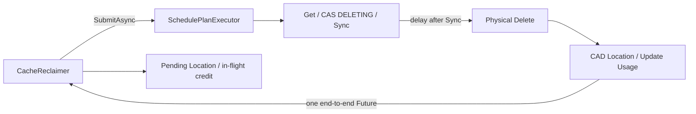

# CacheReclaimer 异步删除与过度逐出优化设计

| 项目 | 内容 |
|---|---|
| 状态 | V1 已实现，包含 `CacheMetaDelRequest` 异步接口；未来扩展未纳入 |
| 更新时间 | 2026-07-17 |
| 涉及模块 | `manager`、`meta`、`metrics`、`service` |
| 关联需求 | [CacheReclaimer 过度逐出优化](https://project.aone.alibaba-inc.com/v2/project/2137612/req/74289896)、[Reclaimer 删除请求提交异步化改造](https://project.aone.alibaba-inc.com/v2/project/2137612/req/80484236) |
| 历史参考 | [PR #161](https://github.com/alibaba/tair-kvcache/pull/161) |

本文档描述当前 V1 的行为契约和设计边界。历史实现与 PR 仅作为背景，实际行为以本文档及主干代码为准。

## 1. 背景

改造前，一次 Reclaimer 删除包含以下步骤：

1. 采样并选择待逐出的 block 和 Location。
2. `SchedulePlanExecutor::Submit` 同步读取 Location 元数据。
3. 同步 CAS，将 Location 更新为 `CLS_DELETING`，并等待 `MetaIndexer::Sync`。
4. 等待 `delay_before_delete_ms`。
5. 异步执行存储删除和 Location 元数据删除。
6. Reclaimer 轮询 Future，处理最终结果。

原有流程有两个直接问题：

- Get、CAS 和 Sync 可能访问远端 Redis，会阻塞 Reclaimer cron 线程。
- 延迟删除期间正式 usage 和 key count 尚未下降，Reclaimer 会继续选择其他 victim，造成过度逐出。

提交异步化后还会增加一个窗口：请求已经进入 Executor，但 CAS 尚未完成，元数据仍是
`CLS_SERVING`，同一 Location 可能被下一轮再次选择。

`delay_before_delete_ms` 是类似租约的安全窗口，用于让已经拿到 URI 的 client 完成读写。本设计保留该
语义，不缩短等待时间。

## 2. 设计范围

### 2.1 V1 目标

V1 只实现以下六项能力：

1. **端到端异步提交**：Get、CAS、Sync 和物理删除在 Executor 中执行，Reclaimer 立即拿到最终 Future。
2. **Pending Location 去重**：本地记录已经接受但尚未完成的 Location，封住“入队到 CAS”窗口。
3. **in-flight 水位 credit**：按 Instance Group 和 Storage Type 记录已提交删除 bytes，并保守记录预计完全删除的 key 数。
4. **Future 生命周期与 credit deadline**：Future 终态后释放临时状态；长期未完成时停止抵扣水位，但继续保留 pending。
5. **有界反压**：限制 pending Location、bytes 和请求数量，防止 Executor 或后端异常时无限提交。
6. **无进展退避**：水位超限但没有实际接受删除请求时，ReclaimCron 必须休眠，不能零间隔空转。

所有本地标识和计数都保持严格的 Instance 隔离。

在上述六项 Reclaimer 能力之外，`SchedulePlanExecutor` 同步补齐
`CacheMetaDelRequest` 的端到端异步提交接口。该接口与 Reclaimer 使用的
`CacheLocationDelRequest` 复用相同的 Admission、延迟物理删除和 Future 收敛链路，但本次不迁移
`ReclaimerTaskSupervisor`、`RemoveCache` 或 `TrimCache` 等现有同步调用方。

### 2.2 V1 非目标

以下能力不进入 V1，实现方向见第 11 节：

1. 卡死任务的自动元数据复核和 pending 自恢复。
2. CAS 后失败的回滚、重试或完整删除状态机。
3. 按 Storage Type 拆分请求、线程池或物理执行资源的严格故障隔离。
4. leader/instance generation、主备切换时的任务取消和跨 epoch drain。
5. 持久化删除任务和跨进程 exactly-once。
6. StorageBackend 底层 I/O 的强制 timeout 和取消。
7. 多层存储迁移能力，包括 migration、copy 和 drain 语义。
8. LRU/LFU/TTL victim 排序算法调整。

文中的正式 usage 是 `MetaIndexer` 维护的逻辑用量，不代表存储后端实时磁盘占用。

## 3. V1 总体方案



一次删除在业务上仍是一个统一任务，只有一个最终 Future。Admission 和 Physical Delete 是 Executor
内部的两个步骤，V1 不在 Reclaimer 中引入显式状态机。

## 4. V1 详细设计

### 4.1 端到端异步提交

新增显式异步接口，保留现有同步 `Submit` 兼容其他调用方：

```cpp
struct AsyncDeleteSubmitResult {
    bool accepted;
    std::future<PlanExecuteResult> future;
};

AsyncDeleteSubmitResult
SchedulePlanExecutor::SubmitAsync(const CacheLocationDelRequest &request);

AsyncDeleteSubmitResult
SchedulePlanExecutor::SubmitAsync(const CacheMetaDelRequest &request);
```

执行流程如下：

1. 创建共享 promise 和最终 Future。
2. 将 Get、CAS 和 Sync 放入 Executor 队列，成功入队后立即返回 `accepted=true`。
3. 只把实际 CAS 成功的 Location 放入物理删除任务。
4. 从 Sync 成功时刻开始计算 `delay_before_delete_ms`。
5. 延迟到期后执行物理删除和最终 CAD。
6. 任一步骤成功、失败或抛出异常，都通过统一完成函数设置最终 promise。

统一完成函数必须保证 exactly-once，避免异常逃出 worker 后留下永远不 ready 的 Future。延迟等待使用
定时队列，不占用 worker。Admission 和 Physical Delete 共用现有 Executor 并发，V1 不拆分线程池。

首次入队失败返回 `accepted=false` 和无效 Future，Reclaimer 不建立任何 pending、credit 或
`DeleteHandler`。现有 `SubmitNonBlocking` 不满足这一契约，因为它不会向调用方返回内部 Future。

#### 4.1.1 两类请求的选择语义

两类异步请求只在 Location selection 阶段分叉：

- `CacheLocationDelRequest` 只选择请求中明确指定的 `location_id`。
- `CacheMetaDelRequest` 选择请求中各 block 的全部有效 Location。

两类请求都跳过不存在或已经处于 `CLS_DELETING` 的 Location。已进入 `CLS_DELETING` 表示删除意图
已经建立，再次提交时必须视为幂等 no-op，不能重复安排物理删除。这个语义与历史同步
`Submit(const CacheMetaDelRequest &)` 可能重新处理 `CLS_DELETING` 的行为不同；本次只约束新增异步
接口，不借此重构或改变旧同步接口。

#### 4.1.2 公共 Admission 流程

两类 Prepare 只负责请求校验、读取元数据和生成 CAS plan，后续步骤必须共用同一实现：

```text
PrepareDeleteTask(Meta / Location)
    -> select locations and build CAS plan
    -> BatchCASLocationStatus
    -> FillActualTask
    -> MetaIndexer::Sync
    -> LocationDelAdmissionResult
```

公共 CAS/Fill/Sync 函数复用 Prepare 阶段已经取得的 `MetaIndexer`，不得为执行公共尾部再次查询
Indexer。只有实际 CAS 成功的 Location 才进入 `actual_task`；没有可删除 Location 时，Admission
直接以成功完成 Future，不提交空的物理删除任务。

Admission runner 接收 prepare callback，并统一负责：

1. 捕获 Prepare、CAS、Fill 和 Sync 的所有异常。
2. 根据 `LocationDelAdmissionResult` 判断直接完成或二次提交物理删除任务。
3. 从 Sync 成功后开始定时延迟，并通过现有定时队列等待。
4. 为物理删除任务注册 Executor shutdown cancel callback。
5. 处理二次入队失败、物理删除异常和 Executor 关闭。
6. 所有路径只通过共享的 `PromiseCompletion` 收敛端到端 Future。

不能为 Meta 和 Location 分别复制二次 `SubmitRaw`、cancel callback 或异常收敛逻辑；这些路径是
exactly-once 契约的一部分，必须保持单一实现。首次 Admission 已成功入队、但尚未执行时，如果
Executor 停止并清理队列，其 cancel callback 必须把最终 Future 收敛为明确失败。

#### 4.1.3 调用方边界

新增 `SubmitAsync(const CacheMetaDelRequest &)` 只补齐 Executor 的异步能力和两类删除请求的接口
对称性。本次不把 `ReclaimerTaskSupervisor`、`CacheManager::RemoveCache` 或
`CacheManager::TrimCache` 切换到该接口，因此不能据此认为这些调用链的元数据同步阻塞已经解除。

调用方迁移需要另外评估 Supervisor 队列的有界准入、并发量和任务生命周期，避免把原有同步节流
转换为无界 Future 堆积，不属于本次改动范围。

### 4.2 Pending Location 去重

本地唯一标识必须包含 `instance_id`：

```cpp
struct PendingLocationKey {
    std::string instance_id;
    int64_t block_key;
    std::string location_id;
};
```

`FilterLocID` 在原有状态判断之外排除 `pending_locations`。不能只使用 block key 或 location id，
否则会影响其他 Instance。

提交顺序固定为：

1. 过滤已有 pending 和达到硬上限的 Location。
2. 生成非空删除请求并计算 credit。
3. 调用 `SubmitAsync`。
4. 仅当 `accepted=true` 时，立即写入 pending、credit 和 `DeleteHandler`。
5. `accepted=false` 时不修改任何本地计数。

这些操作都由 Reclaimer cron 线程串行完成，因此下一轮 Reclaim 不会插入 accepted 与本地记账之间。

### 4.3 in-flight 水位 credit

扩展现有 `DeleteHandler`，不新增 operation 对象或状态枚举。其逻辑字段包括：

```cpp
struct DeleteHandler {
    std::shared_ptr<RequestContext> request_context;
    std::string instance_id;
    std::string instance_group;

    std::vector<PendingLocationKey> pending_locations;
    BytesByStorageType bytes_by_type;
    uint64_t predicted_deleted_keys;

    std::chrono::steady_clock::time_point submitted_at;
    std::chrono::steady_clock::time_point credit_deadline;
    bool credit_enabled;

    std::future<PlanExecuteResult> future;
};
```

bytes 必须与正式 storage usage 使用相同口径：遍历 Location 的 `location_specs`，解析合法 URI 的
`size`，并按 `ToBaseType(location.type())` 聚合；`VCNS_HF3FS` 必须归一到 `HF3FS`。无法得到
size 的 Location 按 0 bytes 记账，但仍加入 pending 并受数量上限保护。

只有本次请求覆盖某个 block 的全部有效 Location 时，才增加一个 `predicted_deleted_keys`。V1 不跨
多个 `DeleteHandler` 合并推断，允许保守少计。

EventReport Location 由外部 reporter 拥有，只能由 ReportEvent snapshot、delta 或 host lifecycle 清理，不能进入
通用物理存储回收请求。它仍然是 metadata key 上的有效 Location：若一个 block 同时包含 EventReport 与普通
Location，删除全部普通 Location 后 key 仍然存在，因此不得产生 `predicted_deleted_keys` credit。EventReport usage
既不参与按 storage type 的水位，也不计入 group 总 byte 水位，避免 reporter 拥有的外部缓存触发 KVCM 通用
物理回收。EventReport Location 也不能作为 migration cold-tier spec coverage。key-count 水位继续使用
MetaIndexer 的官方总 key 数，无法证明可删除时保持 fail-closed、允许保守多触发而不能提前抵扣。

水位判断改为：

```text
effective_group_bytes =
    saturating_sub(official_group_bytes, credited_group_bytes)

effective_type_bytes[type] =
    saturating_sub(official_type_bytes[type], credited_type_bytes[type])

effective_key_count =
    saturating_sub(official_key_count, predicted_deleted_keys)
```

credit 在请求被 Executor 接受后立即生效，覆盖元数据排队和延迟删除阶段。所有减法使用饱和减法。

同一 Group 一轮内每成功提交一个请求，都要用最新 credit 重新判断水位；水位满足后立即停止该
Group 的后续提交。batch 粒度允许最多一个 batch 的自然 overshoot。

### 4.4 Future 生命周期与 credit deadline

`ReclaimCron` 每轮必须先调用 `HandleDelRes`，再读取正式 usage：

1. Future ready 时，无论成功、部分成功还是明确失败，都释放 credit、pending 和硬上限配额。
2. deadline 到期但 Future 未 ready 时，关闭 credit，但保留 pending 和硬上限配额。
3. 完成旧任务处理后，读取正式 usage 并进行新一轮判断。

这一顺序避免物理删除已经降低正式 usage、旧 credit 却仍然存在造成双重扣减。

credit deadline 定义为：

```text
credit_deadline =
    submitted_at + delay_before_delete_ms + inflight_delete_timeout_ms
```

deadline 到期但 Future 尚未 ready 时：

- 将 `credit_enabled` 置为 false，立即停止抵扣 bytes 和 predicted keys。
- 保留 pending Location 和硬上限配额，防止重复提交及任务数量继续放大。
- 记录 timeout 指标和告警。
- Future 后续真正 ready 时再释放全部本地状态。

invalid、broken 或 deferred Future 按 outcome unknown 处理：立即关闭 credit，保留 pending 和配额
并告警。V1 不在 Reclaimer cron 线程同步查询元数据，也不自动释放这类 pending。

`inflight_delete_timeout_ms` 只控制水位 credit，不会中止底层 I/O。

### 4.5 有界反压

V1 只维护两层上限：

1. 每个 `Instance Group × BaseStorageType` 的 pending Location 数和 pending bytes 上限。
2. 进程级 pending `DeleteHandler` 数和 pending bytes 上限。

某个 Type 达到上限时，只停止该 Group 中该 Type 的新删除准入；进程级上限触发时停止全部新提交。
一个请求包含多个 Type 时，对达到上限的 Type 进行裁剪，并基于最终请求重新计算 bytes 和
predicted keys。

所有未完成 `DeleteHandler` 都占用上限，与 `credit_enabled` 无关。credit 到期不能返还配额；只有
Future 终态才能正常释放。无法解析 size 的 Location 仍受 Location 数和进程级请求数上限约束。

上限的目标是限制内存、队列和删除意图的增长，不承诺共享 Executor 下的物理执行隔离。卡死任务
可能长期占用配额，V1 选择告警和安全失败，不做自动元数据复核。

### 4.6 无进展退避

水位超限不等于本轮取得进展。`TryReclaimOnGroup` 区分：

- `made_progress=true`：实际有非空请求被 Executor 接受。
- `made_progress=false`：候选都已 pending、达到上限、没有候选、请求为空，或 `SubmitAsync` 被拒绝。

只有 `made_progress=true` 才允许快速开始下一轮。水位仍超限但没有实际提交时，ReclaimCron 使用
正常轮询间隔；如果轮询间隔配置为 0，至少等待 1ms，避免持续采样和空请求提交造成 CPU 空转。

`SubmitDelReq` 同时保护空请求：空请求不得进入 Executor，也不得建立 `DeleteHandler`。

## 5. 并发与数据所有权

pending 集合、`DeleteHandler`、credit 和上限计数只允许由 Reclaimer cron 线程修改，不需要额外
加锁。

`CacheReclaimer` 的并行 sampling workers 只返回采样结果，禁止直接读写上述状态。这是 V1 必须
保持的无锁不变式。

## 6. V1 异常语义

| 场景 | V1 行为 |
|---|---|
| 首次入队失败 | 不建立 pending/credit，本轮无进展并退避 |
| Admission 已排队时 Executor 停止 | cancel callback 将端到端 Future 收敛为明确失败 |
| Future 正常或明确失败 | 释放 pending、credit 和上限配额 |
| Future 超过 deadline | 关闭 credit，保留 pending 和配额，告警 |
| invalid/broken/deferred Future | 按 outcome unknown 处理，关闭 credit 并保留 pending |
| 部分 CAS | 按提交值保守记账，Future 终态或 deadline 时统一处理 |
| CAS 后、物理删除前失败 | Future 返回失败并告警；V1 不自动回滚或复核元数据 |
| 进程退出 | 本地状态直接丢弃，不同步等待任务，也不持久化 |

V1 的取舍是：正常路径完整闭环，异常路径优先避免继续扩大删除量；永久 pending 依赖告警和运维
处置。更完整的自恢复能力放到未来扩展。

## 7. 可观测性

V1 提供以下指标：

| 指标 | 说明 |
|---|---|
| pending DeleteHandler/location/bytes | 当前未完成任务及其配额占用 |
| credited delete bytes by Group/Type | 当前参与水位抵扣的 bytes |
| predicted deleted key count | 当前 key count credit |
| oldest pending request age | 识别卡死任务 |
| credit timeout count | credit 到期次数 |
| pending limit reject count | 反压触发次数及 Group/Type |
| duplicate pending location filtered count | pending 去重次数 |
| reclaim no-progress/backoff count | 水位超限但没有实际提交的次数 |
| submit/complete/fail count | 删除请求生命周期统计 |
| executor waiting/executing task count | Executor 排队和执行状态 |

日志和事件至少携带 trace id、instance id、Instance Group、block/location 数量和 bytes。Group/Type
明细通过 metrics tags 保留，Kmonitor reporter 同时上报进程级聚合值。

## 8. 测试方案

### 8.1 单元测试

1. `SubmitAsync` 在元数据后端变慢时快速返回，Get/CAS/Sync 在 worker 中执行。
2. `delay_before_delete_ms` 从 Sync 成功后计算，等待期间不占用 worker。
3. worker 任一步骤失败或抛异常时，最终 Future 只完成一次。
4. pending Location 在 CAS 前阻止重复选择，不同 Instance 互不影响。
5. bytes 按 Group/Type 正确记账，`VCNS_HF3FS` 与正式 usage 一样归入 `HF3FS`。
6. predicted keys 只在请求覆盖全部有效 Location 时增加。
7. 每轮先回收 Future，不会同时扣减已下降的正式 usage 和旧 credit。
8. Future 终态释放全部临时状态；deadline/invalid Future 只关闭 credit 并保留 pending。
9. 饱和减法不会发生 unsigned underflow。
10. 单个 Group × Type 达到上限时只阻塞该 Type；进程级上限阻止全部新提交。
11. credit 到期不会释放硬上限配额。
12. 水位超限但未接受非空请求时返回 no-progress，并触发退避。
13. 空请求不会进入 Executor 或建立 `DeleteHandler`。
14. `SubmitAsync(CacheMetaDelRequest)` 快速返回，Get/CAS/Sync 在 worker 中执行，并选择 block 下全部
    有效 Location。
15. Meta 异步请求跳过 `CLS_DELETING`，重复提交不会再次安排物理删除。
16. Admission 已进入队列但尚未执行时停止 Executor，cancel callback 使 Future 以错误终态完成。
17. EventReport Location 不进入物理删除请求，但与普通 Location 共存时仍阻止错误的
    `predicted_deleted_keys` credit。
18. EventReport usage 不触发 group 总 byte 水位或 EventReport storage-type 水位。
19. reporter URI host 即使与 migration target storage 同名，也不能补齐 cold-tier spec coverage。

### 8.2 集成测试关注点

1. 设置较大的 `delay_before_delete_ms`，验证水位 credit 能阻止连续提交大量删除。
2. 延迟 Get/CAS/Sync，验证 Reclaimer cron 不被阻塞且同一 Location 不重复提交。
3. Future 超过 deadline 后，验证 credit 回弹、pending 保留且提交量受硬上限约束。
4. 某个 Group × Type 达到上限后，验证其他未饱和 Type 在 Executor 可用时仍可提交。
5. 没有有效 victim、全部 pending 和入队拒绝时，验证 ReclaimCron 不会零间隔空转。
6. 同一 Group 多 Instance 时，验证一轮内水位满足后停止继续提交。

## 9. 验收标准

1. Reclaimer 删除提交耗时不再包含 Get、CAS 和 Sync 延迟。
2. 同一个 `PendingLocationKey` 不会被同时提交两次。
3. 大 `delay_before_delete_ms` 下，删除提交量不会随 ReclaimCron 轮数持续增长。
4. Future 终态后，pending、credit 和上限配额全部释放。
5. 超过 deadline 的任务不再抵扣水位，但仍阻止重复提交并占用硬上限。
6. 未完成请求和删除 bytes 不超过配置上限。
7. 水位超限但无实际提交时，ReclaimCron 会退避而不是空转。
8. 现有同步删除调用方保持兼容。
9. Meta 和 Location 异步请求共用 CAS/Fill/Sync、二次入队、shutdown cancel 和 exactly-once Future
   收敛逻辑。
10. 新增 Meta 异步接口不会隐式改变 `RemoveCache`、`TrimCache` 或 `ReclaimerTaskSupervisor` 的调用
    行为。

## 10. 实现落点与默认参数

主要实现文件：

| 文件 | 职责 |
|---|---|
| `manager/schedule_plan_executor.h/.cc` | 异步 Admission、定时等待、物理删除、最终 CAD 和 promise 完成 |
| `manager/cache_reclaimer.h/.cc` | pending、credit、deadline、反压和 no-progress 退避 |
| `manager/cache_manager.h/.cc` | 将异步删除配置装配到 Reclaimer |
| `service/server_config.h/.cc` | 配置注册、默认值和合法性检查 |
| `service/server.cc` | 从服务配置构造 `CacheReclaimerAsyncDeleteConfig` |
| `metrics/kmonitor_metrics_reporter.cc` | 生命周期、credit、反压和退避指标上报 |

V1 默认参数：

| 配置 | 默认值 | 说明 |
|---|---:|---|
| `inflight_delete_timeout_ms` | 60000 | 删除 delay 之外允许 credit 继续生效的时间 |
| `pending_location_limit_per_group_type` | 100000 | 单 Group × BaseStorageType 的 pending Location 上限 |
| `pending_bytes_limit_per_group_type` | 64 GiB | 单 Group × BaseStorageType 的 pending bytes 上限 |
| `pending_delete_handler_limit` | 1024 | 进程级 pending 请求上限 |
| `pending_bytes_limit` | 256 GiB | 进程级 pending bytes 上限 |

no-progress 默认复用 `cache_reclaimer_idle_interval_ms`；该值为 0 时使用 1ms 的安全下限。

## 11. 未来扩展工作

以下工作需要在 V1 指标证明有必要后单独设计，不属于当前实现：

1. **异步 reconciliation**：对超时或 invalid Future 批量复核 Location 状态，必须通过 Executor、有界执行，不能在 cron 线程同步访问 Redis。
2. **CAS 后补偿状态机**：区分 CAS 前失败、CAS 后未入队、物理结果未知等阶段，并设计重试、回滚或 `UNCERTAIN` 处理。
3. **自动恢复永久 pending**：在 reconciliation 结果可信后安全返还配额，减少人工干预。
4. **严格的 Storage Type 故障隔离**：按 Type 拆分请求、Future、线程池或队列，避免坏后端占用共享 worker。
5. **主备切换安全**：为异步任务携带 leader/instance generation，在 Admission 和 Physical 阶段校验，并定义 demotion 时的 drain/cancel。
6. **持久化任务与跨进程恢复**：进程重启后恢复删除意图和 pending 状态。
7. **StorageBackend I/O timeout/cancel**：为阻塞的物理删除提供真实中止能力。
8. **精确部分结果记账**：根据实际 CAS 成功 Location 提前修正 credit，而不是等待最终 Future。
9. **多层存储迁移协同**：migration、copy 和 drain 语义另行专项处理。
