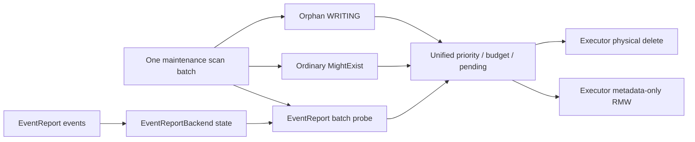

# EventReport 主动回收纳入统一后台 GC 设计

| 项目 | 内容 |
|---|---|
| 状态 | V1 实现中；本文替代 cleanup intent / 双扫描 lane 方案 |
| 更新时间 | 2026-09-01 |
| 依赖 | [后台扫描 GC](cache_garbage_collector.md)、[ReportEvent 增量上报与权威快照](report_event_snapshot_uri_version.md) |
| 涉及模块 | `manager`、`data_storage`、`meta`、`metrics`、`service` |

本文定义 EventReport metadata 主动回收接入常驻后台 GC 的行为契约。核心边界是：

- `CacheGarbageCollector` 负责周期扫描、候选预算、pending 和 action dispatch；
- `EventReportBackend` 负责 Reporter 生命周期、Snapshot generation 和“当前是否允许清理”的业务判定；
- `SchedulePlanExecutor` 承载异步 action，并在 worker 中完成最终 Backend/token/expected-value 复核；
- Snapshot、`HOST_DOWN`、Heartbeat 和 REGISTER 只更新 Backend 当前状态，不向 GC 登记任务或触发扫描。

该设计只改变垃圾发现和调度方式，不改变 ReportEvent 写入、Snapshot 提交、查询可见性和 Reporter 生命周期协议。

## 1. 背景

### 1.1 现有问题

EventReport metadata 描述 Reporter 外部维护的 cache，不是由 KVCM DataStorage 接口直接管理的物理数据。旧实现有两条主动回收路径：

| 触发事件 | 旧行为 |
|---|---|
| Snapshot 成功提交 | 投递 `CleanupStaleSnapshotLocations`，全量扫描目标 Instance |
| `HOST_DOWN` 或 heartbeat timeout 后超过 cleanup grace | 投递 `CleanupHostLocations`，再次全量扫描目标 Instance |

一次事件对应一次全 Instance 扫描。连续 Snapshot、多个 Reporter 同时下线或任务重试时，同一个 keyspace 会被重复扫描，成本近似“事件数 × keyspace”，并与 Reclaimer、Migration 和删除任务争用共享 Executor。

成功 Snapshot 已在查询侧隐藏完全属于旧 generation 的 Location；Reporter unavailable/unregistered 后查询也不会返回其 Location。因此本需求主要解决 metadata 最终回收，不要求每个事件立即触发扫描。

### 1.2 新模型

V1 改为状态驱动的周期 reconciliation：

```text
Snapshot / Heartbeat / REGISTER / HOST_DOWN
  -> 只更新 EventReportBackend 当前状态

GC regular round
  -> 一次 maintenance metadata scan
  -> 普通 WRITING/SERVING 判定
  -> EventReportBackend 批量判定
  -> 统一预算与异步 action
```

多个事件天然合并为扫描时看到的最新 Backend 状态。GC 不再维护 cleanup intent map、revision、EventReport 专用 cursor/pass、recovery discovery 或独立 retry lane。

## 2. 设计范围

### 2.1 V1 目标

1. EventReport 与长期 WRITING、普通 storage-missing SERVING 共用同一个 GC round、Instance cursor 和 `MaintenanceScanBatch`。
2. EventReport 清理资格由 Backend 批量、三态、fail-closed 地判定；GC 不解析 Snapshot 内部状态。
3. 保留 committed/in-flight generation、Snapshot attempt、Reporter lifecycle generation 和 Backend incarnation fencing。
4. EventReport 只做完整 expected value 校验后的 metadata 删除，不触发物理 `DELETE`，不进入 `CLS_DELETING`。
5. 所有候选共用原因优先级、Location 总预算、Instance 隔离、pending 和 GC inflight 窗口。
6. EventReport action budget 按唯一 Block key 计数；一个已准入 key 可以批量携带多个 EventReport Location。
7. 每个 active Instance 每次只推进一个 cursor batch，按 Instance round-robin，避免大 Instance 独占 active round。
8. action 在 Executor worker 中重新校验 Backend/token 并执行 no-touch expected-value RMW；失败由后续周期扫描重新发现。
9. 默认 full-round cooldown 为 2 小时；配置在启动时读取，不实现热更新。

### 2.2 V1 非目标

1. cleanup intent、EventReport 专用 scan lane、事件唤醒或为每种清理原因建立独立全表任务。
2. 持久化 GC cursor、pending、Future、Reporter generation 或删除任务。
3. Reporter 到 Location 的反向索引、Redis ZSET、CDC 或事件到 key 的直接索引。
4. 通用动态 Rule Engine、插件注册或统一复杂 token ABI。
5. EventReport 物理删除、`CLS_DELETING` 流转或 storage URI version/epoch。
6. Block TTL、长期 `CLS_DELETING`、闲置 Instance 和 distributed GC lease。
7. EventReport 独立扫描线程、独立线程池或独立并发窗口。
8. Executor 进程级队列容量控制。当前 Executor 队列仍是公共基础设施，其全局限流会影响 Reclaimer、Migration 等调用方，应作为独立需求处理。
9. GC 配置热更新和缩短 cooldown 时主动唤醒。

### 2.3 依赖与灰度

迁移期保留 `kvcm.cache_gc.event_report_cleanup_enabled`：

- `false`：继续使用 legacy per-event cleanup；
- `true`（默认）：当 `kvcm.cache_gc.enabled=true` 时，事件只更新 Backend 状态，由 regular round 回收；
- GC 总开关关闭时，子开关不单独启动线程，EventReport 继续使用 legacy per-event cleanup，配置仍然有效。

开关和其他 GC 参数均不支持热切换，修改后重启生效。新路径稳定后，可在独立清理提交中删除 legacy 路径和临时开关。

回滚不是对称重放：`true -> false` 后，legacy 只能处理之后发生的新事件，不能重放 GC 开启期间已经发生的 Snapshot/HOST_DOWN。紧急回滚允许 stale metadata 暂时残留；查询可见性不依赖其立即物理清理。

对于仍能在 maintenance view 中观察到的目标，保守发现时间约为：

```text
当前 round 剩余时间 + round_pause_ms + 下一 round 扫描到目标的时间
```

默认 `round_pause_ms=2h`。持续 Backend/metadata 错误、inflight 窗口长期占满，以及 dual-backend 中已从内存淘汰的冷 key 不在有限收敛保证内。若未来需要独立的小时级或分钟级 SLO，可增加无 intent 的独立 Candidate Source/cadence，但不恢复 per-event full scan。

## 3. 架构与职责

### 3.1 一个 scan，多种判定

每个 GC tick 最多扫描当前 Instance 的一个 maintenance batch，并在同一份快照上执行：

1. 长期 `CLS_WRITING` 判定；
2. 普通 `CLS_SERVING` 的批量 `MightExist()` 判定；
3. EventReport `CLS_SERVING` 的 Backend 批量 maintenance probe；
4. 候选合并、优先级排序、budget 和 pending 过滤；
5. 普通物理删除与 EventReport metadata action 分别提交 Executor；
6. 两类 Future 统一进入 GC inflight 窗口。



同一 Location 在一个 batch 中最多形成一个候选。物理删除优先提交；如果它占满最后一个 GC inflight 槽位，本批 EventReport 候选不提交，并由后续 round 重新发现。

### 3.2 模块边界

GC 负责：

- Registry Instance 快照、per-Instance cursor 和 round cooldown；
- no-touch maintenance scan；
- Storage 路由、批量 probe、shape/异常隔离；
- 候选优先级、预算、pending、dispatch 和 Future 轮询。

`EventReportBackend` 负责：

- Reporter node table、availability、heartbeat timeout 和 cleanup grace；
- committed/in-flight Snapshot generation、attempt epoch；
- lifecycle generation/tombstone；
- `Keep / DeleteMetadata / Unknown` 判定；
- action-time cleanup token/lease 复核。

Executor 负责：

- 首次入队 accepted/Future 契约；
- 在 worker 中重新查找当前 Backend incarnation；
- 获取 token 对应 lease；
- 调用 MetaSearcher 完成 no-touch expected-value metadata RMW；
- 统一 promise exactly-once 完成和停机 cancel。

GC 不读取 `snapshot_versions_`、`node_generation_`，也不复制 stale Snapshot 规则。

### 3.3 Backend owner 路由

普通 Storage 可以从 URI host 解析 storage global unique name；EventReport 的 Location ID/URI host 表示 Reporter，不表示 Backend owner。因此 GC 按以下信息路由：

```text
instance_id
  -> InstanceGroup.event_report_storage_candidates
  -> location.type()
  -> 唯一 EventReportBackend
```

V1 要求同一 InstanceGroup 内，每个 EventReport storage type 最多有一个 Backend owner：

- Admin 创建/更新 InstanceGroup 时拒绝已知的同 type 重复 owner；
- 运行时未注册或 type 不符的 candidate 跳过，与在线 `ReportEvent` 的 matching-type 路由一致；遍历后没有 matching owner 时返回 unknown；
- matching Backend unavailable 或同 type 多 owner 一律返回 unknown；
- 不能在 A 暂时不可用时静默切到同 type 的 B，因为 B 不拥有 A 的 Reporter lifecycle 状态。

提交 action 时同时保存 Backend unique name 和弱引用。Executor 必须重新按 unique name 查找，并要求对象 identity、type 和 available 状态仍匹配。

### 3.4 Backpressure 边界

普通物理删除与 EventReport action 共用：

- `CacheGarbageCollector::max_inflight_delete_requests`；
- `pending_locations_`；
- `SchedulePlanExecutor` 的 worker；
- Future 终态释放流程。

这是 GC 调用方级的有界反压，不是 Executor 全局限流。即使 GC 只保留默认 2 个在途任务，Reclaimer、Migration 等其他调用方仍按现有 Executor 语义提交。V1 不修改公共队列容量、任务类别配额或全局 admission。

## 4. EventReport 判定契约

Backend 批量接口返回：

```cpp
enum class MaintenanceCleanupDecision {
    kKeep,
    kDeleteMetadata,
    kUnknown,
};

struct MaintenanceLocationProbe {
    std::string instance_id;
    std::string location_id;
    std::vector<std::string> storage_uris;
};

struct MaintenanceCleanupToken {
    MaintenanceCleanupReason reason;
    ReporterSnapshotKey reporter_key;
    uint64_t lifecycle_generation;
    std::string committed_version;
    uint64_t snapshot_attempt_epoch;
};
```

`kUnknown`、异常或 shape 不一致都不授权删除。

### 4.1 stale Snapshot

active 且处于 strict visibility 的 Reporter，只有 Location 不包含任何当前 committed 或 in-flight generation spec 时才可删除。

- 任一 spec 属于 committed/in-flight：保留完整 Location；
- 全部是语法合法的旧/legacy spec：返回 `DeleteMetadata`；
- URI/version malformed、Snapshot 状态缺失或 soft visibility：返回 `Unknown`；
- 空 spec 仅在 Backend 能明确按现有协议判定 stale 时删除。

token 保存 committed version、attempt epoch 和 lifecycle generation。Executor 获取 lease 时原子复核这些状态；并发 Snapshot/REGISTER 已推进状态时，旧 token 变为 stale。

### 4.2 Heartbeat timeout 与 cleanup grace

必须保留两阶段行为：

```text
last heartbeat + heartbeat_timeout
  -> Reporter unavailable，查询不可见，但 probe 返回 Keep

unavailable_since + cleanup_grace
  -> generation-checked unregister
  -> probe 才返回 DownHost DeleteMetadata
```

当前默认 heartbeat timeout 为 30 秒、cleanup grace 为 5 分钟，均来自 EventReport Storage 配置，不硬编码在 GC。显式 `HOST_DOWN` 成功 unregister 后可直接进入 DownHost 清理资格。

Reporter 在 grace 内恢复，或下线后重新 REGISTER 形成新 lifecycle，旧 token 在 Executor worker 中复核为 stale，不删除新生命周期数据。

### 4.3 重启后的 absent Reporter

进程重启、升主或重新启用 Backend 后，node table 和 tombstone 可能为空。系统建立：

```text
maintenance_recovery_deadline =
  maintenance_admission_time + heartbeat_timeout + cleanup_grace
```

deadline 前，无法找到 Reporter 的 probe 返回 `Unknown(recovery_grace)`；deadline 后仍不存在时，才返回 `RecoveryAbsentHost` token。

`maintenance_admission_time` 在每次 Leader 启动 GC worker 前重置；运行期新建或重新启用 Backend 时也会重置。这样 recovery 时间不会提前消耗 Reporter 真正能够 REGISTER/heartbeat 的窗口。该 grace 只影响对应 EventReport Location 的判定，不暂停 shared GC round，也不阻塞同 batch 的 WRITING、普通 MightExist 或其他 Backend。重启会重新开始 grace；V1 选择 fail-closed，不持久化 absent deadline。

Executor 执行 `RecoveryAbsentHost` action 时必须在 Backend availability lease 内重新检查当前 recovery deadline。若 token 入队后 Backend 经历 disable/re-enable，新 grace 期内返回 busy 并留给后续 round 重试，旧 token 不能跨越新恢复窗口删除 metadata。

## 5. 调度、预算与 Action

### 5.1 per-Instance round-robin

round 开始时取得一次 Group/Instance 快照，每个 `InstanceScanEntry` 保存独立 cursor 和 completed 标志。调度规则是：

1. 当前 Instance 扫描一个 batch；
2. 保存其 next cursor；
3. 无论是否到 base，都轮转到下一个未完成 Instance；
4. 所有 Instance 到 base 后结束 round并进入 cooldown；
5. 单 Instance scan 失败时保留原 cursor，但先让其他 Instance 推进；同一 round 连续 3 次失败后跳过该 Instance，下一 round 从 base cursor 重试，不能阻塞 round 完成和 Registry 新快照。

该公平性只防止一个大 Instance 长期独占 GC tick，不改变 Reclaimer 的 victim fairness。

dual-backend 扫描内存 cache backend；single-backend 扫描唯一 backend。内存视图中未加载或已淘汰的冷 key 可能不被发现，这是避免周期全扫 Redis 的显式 best-effort 取舍。

### 5.2 候选优先级与预算

固定优先级：

```text
orphan WRITING
  > ordinary storage-missing
  > EventReport down host
  > EventReport recovery-absent host
  > EventReport stale snapshot
```

预算规则：

- 所有原因合计最多准入 `scan_batch_size` 个 Location；
- EventReport action 最多包含 `event_report_action_batch_size` 个唯一 Block key，默认 32；
- 一个已准入 Block key 可以携带多个 EventReport Location，但 Location 总数仍受总预算限制；
- pending target 不重复准入；
- 超预算、Executor 拒绝或 inflight 已满的候选不进入 deferred queue，只记录指标并等待后续 round 重新发现。

按 key 限制 EventReport action，是因为 metadata RMW、shard lock 和异步持久层写入的主要固定成本都按 Block key 发生；Location 总上限继续限制单请求序列化和遍历成本。

### 5.3 EventReport 异步 metadata action

GC 构造：

```text
instance_id
block_keys[]
targets[][] = {
  location_id,
  expected_location_value,
  backend_unique_name,
  backend identity,
  storage_type,
  cleanup_token
}
```

`SubmitAsync(EventReportMetadataDelRequest)` 首次入队失败返回 `accepted=false`，不建立 GC pending/inflight。accepted 后 Future 与 pending 进入普通 GC 窗口。

Executor worker 对每个 Block key：

1. 重新获取 MetaIndexer；
2. 重新按 Backend unique name 查找当前 EventReportBackend；
3. 校验 Backend identity/type/available，并按 Backend unique name 的稳定顺序取得 availability lease；
4. 在 Backend lease 内按稳定顺序获取该 key 所需 Reporter cleanup lease；
5. stale token 视为正常 mismatch；busy/unavailable 视为可重试错误；
6. 通过 `MetaSearcher::BatchDeleteLocations(... expected_values, maintenance_no_touch=true)` 执行普通 expected-value RMW；
7. 持有 Backend availability lease 和 Reporter lease 到 RMW 结束，记录 `deleted/noent/mismatch/error`，统一完成 promise。

该 action 不调用 DataStorage `Delete()`，不修改 Location status，不进入 `CLS_DELETING`。

maintenance RMW 与现有 metadata 写路径使用相同的 per-key mutation fence 和一致性级别：

- 对可能异步持久化的 metadata backend，在 shard fence 内执行读前 `Sync(key)`，确保此前 accepted 的同 key 写入对 expected-value 比较可见。cached metadata 的 hot view 在同一 shard fence 内同步删除，且 persistent queue 保持同 key 顺序，因此删除后直接释放锁；persistent-only backend 没有该 hot fence，仍在释放锁前执行第二个 `Sync(key)`。读前 barrier 失败时不执行 mutation；删后 barrier 失败保留 accepted 的 per-target 结果和一次性 accounting，同时以 aggregate hard error 交由后续 round 重试；
- dual-backend 同时 no-touch 读取 hot 与 persistent target：一侧缺失允许幂等收敛，两侧均存在但值不同则返回 mismatch；
- 整 key 回收必须在删除前确认 hot 与 persistent 均不存在非目标 sibling；无法证明时只删目标 Location；
- 删除仍按 persistent -> hot 的现有镜像顺序执行，整 key 删除失败时保留可被后续 round 重新发现的 Location；
- single-backend 直接复核唯一 backend；
- metadata cached recovery 尚未完成时 fail-closed，等待后续 round；
- 不增加逐层 mutation receipt、maintenance-pending 栅栏或精确跨进程补偿；
- async persistent write 的最终持久化与 accounting 风险沿用普通 RMW 语义，失败由持续扫描 best effort 重试。

### 5.4 Future、pending 与失败

两类 action 统一遵守：

- 只有 `accepted=true` 且 Future valid 才建立 pending；
- pending key 为 `(instance_id, block_key, location_id)`；
- Future ready、异常或 invalid 都释放对应 pending 和 inflight 槽位；
- `EC_OK/EC_NOENT/EC_MISMATCH` 都是可收敛终态；hard error 记录后由后续 round 重发现；
- GC 不为 EventReport 维护 retry batch、receipt 或独立 backoff 状态；
- Join 丢弃本地 Future/pending handle，不等待已接受 action；Executor 继续 best effort，执行时仍需重新校验依赖和 token。

如果 action 在 persistent/hot 之间部分失败，处理级别与普通 metadata RMW 一致，不为 GC 单独建立更强事务。持续异常通过 Future 结果、pending age 和下轮候选观测暴露。

## 6. 生命周期与并发

升主和降级沿用基础 GC：

```text
升主：
  Registry/CacheManager recover
  -> GC.Start 重置 EventReport recovery grace
  -> 启动 GC worker
  -> 开放 leader-only 请求

降级：
  GC.RequestStop + Reclaimer.Pause
  -> DisableLeaderOnlyRequests
  -> WaitForAllLeaderOnlyRequestsToComplete
  -> GC.Join
  -> Migration/CacheManager/Registry cleanup
```

EventReport 事件不向 GC 写 intent，因此 `RequestStop` 之后仍可完成 Backend 自身状态更新。Join 只等待当前 GC tick 的同步 scan/probe 返回，不等待已经提交给 Executor 的 action Future。

关键仲裁：

| 并发场景 | 保护 |
|---|---|
| scan 后发生 Snapshot/Delta | action-time token lease + expected value mismatch |
| down-host cleanup 与重新 REGISTER | lifecycle generation + cleanup lease |
| Backend disable/remove/recreate | unique name + object identity + type 校验；Backend availability lease 持有到 metadata RMW 完成 |
| GC 重复扫描同一 target | GC pending |
| GC 与 Reclaimer 同时处理同一 Location | expected-value/CAS 最终仲裁 |
| cached metadata recovery | maintenance RMW recover guard |
| 同 block 多 Reporter | lease 稳定排序；一个 per-key RMW |

## 7. 异常与可观测性

| 场景 | 行为 |
|---|---|
| Registry/scan 失败 | 保留 cursor；下一 tick 重试并轮转其他 Instance |
| key `EC_NOENT` | 正常跳过 |
| Backend missing/ambiguous/unavailable | unknown，不删除 |
| probe exception/shape mismatch | 当前 EventReport probe batch unknown，普通规则继续 |
| malformed Location/URI/version | unknown，不删除 |
| recovery grace | 仅对应 EventReport target unknown，不暂停 shared round |
| token stale / expected mismatch | 正常竞态，当前 action 跳过 |
| token busy / metadata hard error | Future 失败或部分失败，后续 round 重发现 |
| Executor rejected | 不建 pending/inflight；后续 round 重发现 |
| inflight 满 | 不扫描新 batch，形成 GC 调用方硬反压 |

保留或增加以下低基数指标：

| 指标 | 说明 |
|---|---|
| `cache_gc.scan_round_count`、`scan_key_count`、`round_duration_ms` | shared round 进度与成本 |
| `cache_gc.candidate_count{reason}` | 各原因候选数 |
| `cache_gc.candidate_dropped_count{reason,cause}` | 总预算、key budget、inflight 等裁剪 |
| `cache_gc.event_report_probe_count{result}` | keep/delete/unknown/error |
| `cache_gc.event_report_probe_unknown_count{cause}` | malformed、owner、recovery grace 等 |
| `cache_gc.event_report_delete_location_count{reason,status}` | worker 最终删除结果 |
| `cache_gc.inflight_delete_count`、`inflight_delete_age_ms` | 两类 GC action 共用窗口 |
| `cache_gc.operation_error_count{stage}` | 契约或硬错误 |

不再暴露 intent、EventReport pass、receipt、layer mutation 或专用 retry 指标。指标 tag 不包含 Instance、Reporter host、cursor 或 generation。

## 8. 测试方案

### 8.1 Backend 单元测试

1. committed、in-flight 和 mixed-generation Location 保留；合法旧 generation 删除；malformed 返回 unknown。
2. heartbeat unavailable 后在 cleanup grace 内保留；unregister 后生成 DownHost token。
3. 显式 HOST_DOWN 后重新 REGISTER 使旧 token stale。
4. recovery deadline 前 absent 返回 unknown，deadline 后生成 RecoveryAbsentHost token。
5. batch probe 顺序和 shape 稳定；Backend unavailable fail-closed。
6. Snapshot/Down/Recovery token lease 覆盖 acquired、busy、stale；Backend availability lease 阻塞动态 disable/Close 到当前 action 完成。

### 8.2 GC 与 Executor 组件测试

1. 一个 scan batch 同时产生普通物理删除和 EventReport metadata action，只扫描一次。
2. Instance 每个 tick 只推进一个 batch并 round-robin；失败 Instance 不阻塞其他 Instance，重试耗尽后不阻塞下一 round 或新 Instance 快照。
3. 未注册或非 matching-type candidate 不遮蔽后续有效 owner；matching owner missing、ambiguous、unavailable 均不删除。
4. 固定优先级、Location 总预算和 EventReport key budget正确；一个 key 的多个 Location 可共同提交。
5. 普通物理删除和 EventReport action 共用 inflight/pending；窗口满时停止扫描。
6. rejected/invalid/exception 不留下本地状态；Future 终态释放全部 pending。
7. recovery grace 只跳过 EventReport，不阻塞同 batch 普通垃圾。
8. Executor 入队后再改变 lifecycle/Backend incarnation，worker 必须重新校验并跳过。
9. expected Location 已更新时返回 mismatch；EventReport 不调用物理 Delete、不进入 `CLS_DELETING`。
10. no-touch maintenance RMW 不改变 LRU/access/revisit，并正确调整内存 charge、storage usage 和 reclaimed key count。
11. cached metadata recovery 时拒绝 action；persistent 已 noent 时仍可幂等清理 hot copy。
12. stale hot 与 newer persistent 不授权删除；跨层存在 sibling 时不执行整 key 回收；整 key 删除失败可重试。
13. Snapshot abort 与已取得的 cleanup lease 串行，不跨 soft visibility 边界删除。
14. Join 不等待已接受 EventReport Future，不发生 UAF。
15. async metadata 的 pending 新写在 maintenance expected-value 读取前完成 barrier，不会被随后入队的删除覆盖；cached mode 依靠同步 hot mutation 作为删后 fence，persistent-only mode 的删后 barrier 在 shard fence 释放前完成。
16. Backend 提前 Open 但 Leader recovery 超过 grace 时，GC Start 仍重新提供完整恢复窗口。

### 8.3 E2E 与性能

1. 连续 Snapshot 后，旧 generation 由后续 shared round 清理，事件数不线性增加全表任务。
2. heartbeat unavailable 阶段不删，cleanup grace 后删除；grace 内恢复不误删。
3. HOST_DOWN 后重新 REGISTER，新 lifecycle metadata 保留。
4. EventReport 物理 Delete 调用数为 0，strict/soft 查询语义不退化。
5. 多 Instance 与普通 GC 垃圾共存时，扫描按 batch 轮转且共享 inflight 生效。
6. 对比 GC disabled、active scan、普通删除和 EventReport action 的 CPU/RSS、metadata QPS、在线请求 P50/P95/P99、round 时长和候选收敛时间。
7. 统计 2 小时 cooldown 内 stale metadata 峰值，并验证默认节奏可接受。

编译、单测和 E2E 的具体执行环境由测试记录约束，不写入设计契约。

## 9. 配置

| 配置 | 默认值 | 说明 |
|---|---:|---|
| `kvcm.cache_gc.enabled` | `true` | GC 总开关；可显式设为 `false` 回退 |
| `kvcm.cache_gc.scan_interval_ms` | 1000 | active round 相邻 tick 最小间隔 |
| `kvcm.cache_gc.round_pause_ms` | 7200000 | full round 完成后的 cooldown；0 表示下一 tick 可开始新 round |
| `kvcm.cache_gc.scan_batch_size` | 256 | scan key hint，也是单 tick Location 总预算 |
| `kvcm.cache_gc.max_inflight_delete_requests` | 2 | 普通与 EventReport action 共用的 GC 在途上限 |
| `kvcm.cache_gc.event_report_cleanup_enabled` | `true` | EventReport shared-round 子开关；仍受 GC 总开关控制，总开关关闭时保留 legacy 路径 |
| `kvcm.cache_gc.event_report_action_batch_size` | 32 | 单 tick EventReport action 的唯一 Block key 上限 |

所有配置启动时读取；V1 不实现运行时热更新。`round_pause_ms` 可以为 0，其他 interval/budget/inflight 必须大于 0。EventReport key budget 与 Scan key hint 是独立上限：前者约束 metadata action 涉及的唯一 Block key 数，后者约束单 tick Location 总预算；key budget 大于 Scan hint 时只是当批通常无法用满，不构成非法配置。

## 10. 实现落点

| 文件 | 调整 |
|---|---|
| `cache_garbage_collector.*` | shared scan、per-Instance cursor、Backend probe、优先级/key budget、两类 action 的统一 inflight/pending |
| `schedule_plan_executor.*` | EventReport metadata-only `SubmitAsync`，worker 内 Backend/token/expected-value 复核 |
| `event_report_backend.*` | batch 三态 probe、recovery deadline、maintenance token/lease |
| `meta_searcher.*`、`meta_indexer.*` | expected-value ordinary RMW 的 no-touch maintenance 入口 |
| `meta_local_backend.*`、`meta_storage_backend_manager.*` | 内存 scan/no-touch read-delete、dual-backend 镜像和 recover guard |
| `admin_service_impl.cc` | 已知配置下拒绝同 Group/type 多 EventReport owner |
| metrics、配置和测试 | 新语义对应的指标、默认值和确定性覆盖 |

V1 不新增线程、intent store、EventReport cursor、receipt、全局 Executor admission 或反向索引。

## 11. 风险与后续演进

1. **best-effort 内存 scan**：dual-backend 下冷 key 可能长期残留；如需完整覆盖，再评估 persistent scan、反向索引或增量 Candidate Source。
2. **周期收敛而非事件即时收敛**：默认 cooldown 2 小时。若数据证明仍过慢，再增加独立但状态驱动的 cadence，不恢复 intent。
3. **共享 inflight 的优先级取舍**：物理垃圾优先，极端持续压力下 EventReport 可能多等一轮；通过 dropped 和 candidate 指标观察。
4. **无跨层事务**：V1 通过双层 expected-value 复核和删除前整 key 判定避免误删，但不引入逐层 receipt 或分布式事务；persistent/hot 部分失败由保留下来的候选和后续 round best effort 收敛。
5. **Backend retirement fail-closed**：owner 被永久移除时缺少 lifecycle 授权，metadata 可能残留；Storage retirement reconciliation 是独立需求。
6. **重启重置 recovery grace**：频繁切主可能延迟 recovery-absent 清理；跨进程 deadline 需要持久化 Reporter lifecycle。
7. **Executor 全局容量**：GC 本地窗口不会限制其他调用方。若共享队列容量成为问题，应单独设计进程级 admission、任务类别配额和可观测性。
8. **动态 pacing/热配置**：V1 固定启动配置。后续若要运行时缩短周期，需要补原子配置快照和 LoopThread 主动唤醒。
9. **async metadata barrier 延迟**：maintenance action 按单个 Block key 持有 shard fence，cached mode 只保留读前 `Sync(key)`，persistent-only mode 保留读前和删除后两个 barrier，等待上界受 metadata sync timeout 约束。它不会同时锁住整个 action batch，但慢 Redis 会增加同 shard 在线请求延迟，需要结合 RMW lock-wait 指标灰度观察。
