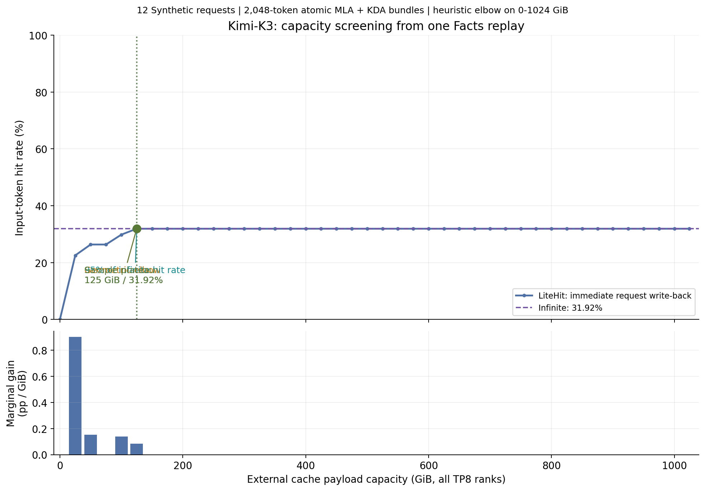
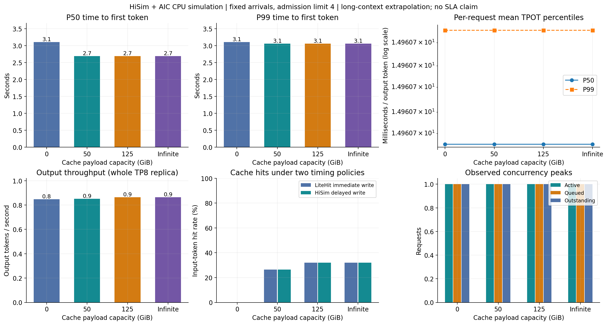
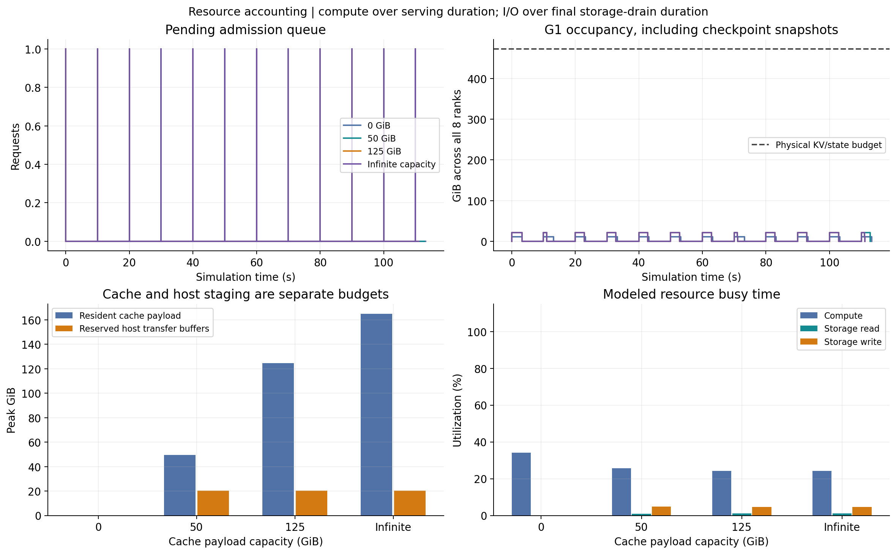

# Kimi-K3 混合缓存容量评估

LiteHit 单遍生成 Facts、43 容量点投影与 HiSim `bench_serving` 仿真已完成。当前样本的几何拐点是 **125 GiB**，达到无限容量命中率 95%：**125 GiB**。容量曲线在 **125 GiB** 达到本样本平台。拐点依赖本次 0–1024 GiB 网格与归一化规则。

在相同固定到达轨迹、准入上限 4 下，125 GiB 相比 0 GiB 的输出吞吐为 **1.02×**，P99 TTFT 下降 **1.5%**。这是含长上下文外推的端到端 CPU 仿真，使用显式缓存与调度策略；未执行 Kimi-K3 GPU kernels，不能作为已校准 SLA 结果。

## 容量曲线



Facts replay 0.0051 秒；43 容量查询 0.0039 秒。516 个逐请求×容量独立 LRU 对照全部通过。计时是当前小样本及已启动环境上的 wall time，不是全量 1.85 GB trace 的性能成绩。

## 同一负载下的服务指标



| 容量 GiB | LiteHit / HiSim 命中率 | TTFT P50 / P99 秒 | TPOT P50 / P99 毫秒 | 输出 token/s | 峰值 active / queued / outstanding |
|---:|---:|---:|---:|---:|---:|
| 0 | 0.00% / 0.00% | 3.11 / 3.11 | 14.96 / 14.96 | 0.85 | 1 / 1 / 1 |
| 50 | 26.37% / 26.37% | 2.70 / 3.07 | 14.96 / 14.96 | 0.85 | 1 / 1 / 1 |
| 125 | 31.92% / 31.92% | 2.70 / 3.07 | 14.96 / 14.96 | 0.86 | 1 / 1 / 1 |
| ∞ | 31.92% / 31.92% | 2.70 / 3.07 | 14.96 / 14.96 | 0.86 | 1 / 1 / 1 |

TTFT 从原始到达时刻计到首 token，包含排队、缓存读/H2D 和 prompt 计算。TPOT 对每请求先计算 `(最后 token − 首 token)/(output_len−1)`，再取请求间 P50/P99；它与逐 token ITL 分位数不同。输出吞吐为全部 output tokens 除以最早到达至最后完成的时长，覆盖整个 TP8 副本，未按 GPU 再乘除。

12 请求在 110.000 秒内到达，而各配置服务完成耗时为 111.1–113.2 秒。各容量平均准入等待为 0.000–0.000 秒。所有请求最终完成也不能证明最大可持续并发或 SLA。

## 两阶段命中差异

LiteHit 在请求序列上立即将全部完整 prompt 对象倒序提交；HiSim 在准入时查询，读取会 touch 并持有 pin，新对象要等 prompt 完成、D2H 和存储写完成才可见。请求完成顺序、已读对象保护和有限容量淘汰顺序随调度变化。因此有限容量下两阶段命中率不存在普遍的上界关系；无限容量下，延迟可见性使部分本可复用的前缀来不及命中。

| 容量场景 | 命中更多请求 | 命中更少请求 | 相同请求 | 净变化 input tokens |
|---|---:|---:|---:|---:|
| capacity_0gib | 0 | 0 | 12 | +0 |
| capacity_125gib | 0 | 0 | 12 | +0 |
| capacity_50gib | 0 | 0 | 12 | +0 |
| capacity_infinite | 0 | 0 | 12 | +0 |

逐请求差异见 [hit_comparison.csv](../stage2/hit_comparison.csv)，可连接各容量的 `request.jsonl` 与 `storage.jsonl`。

## 并发与内存



配置准入上限、回放观察到的 active/outstanding 峰值和物理内存上限含义不同。本组主对照使用准入上限 4，各配置实际峰值见表；outstanding 包含队列，不能当成 GPU 同时执行的请求数。

G1 预算按 AIC 权重与 activation/runtime/communication 开销扣除后计算，为每 rank 59.082 GiB，合计 472.653 GiB。每个准入请求预留完整 input+max_output MLA、两个活跃 KDA 槽，以及每个完整输入 checkpoint 的 KDA snapshot；snapshot 在 D2H 完成后释放。命中前缀仍要加载至 G1，跨请求 G1 prefix sharing 关闭。这是保留 GPU checkpoint 到 prompt 结束再整组写出的保守策略，不能套用仅含两槽状态的理论并发上界。G1 使用共享字节预算；默认 SGLang 分离的 MLA/state 池还可能各自先耗尽，实际部署需另加对应池约束。

| 容量场景 | G1 峰值 GiB (TP8) | 常驻 cache 峰值 GiB | host staging 预留峰值 GiB | 驱逐对象数 | pin 导致放弃写入对象数 |
|---|---:|---:|---:|---:|---:|
| capacity_0gib | 10.98 | 0.00 | 0.00 | 0 | 0 |
| capacity_50gib | 21.02 | 49.58 | 20.17 | 153 | 0 |
| capacity_125gib | 21.02 | 124.38 | 20.17 | 48 | 0 |
| capacity_infinite | 21.02 | 164.72 | 20.17 | 0 | 0 |

外部 cache capacity 只计 tensor payload。Host 读写暂存空间单独记录且未设上限，按传输入队时预留整个 buffer 计算，峰值是保守预留量。若 cache 和暂存共用主机 RAM，需要另外纳入暂存、索引与 allocator 开销；不能将 250 GiB payload 解读成机器只需要 250 GiB RAM。

## 缓存对象与源码实现

Kimi-K3 配置有 24 层 MLA 和 69 层 KDA。使用 attention TP8、BF16 MLA/conv 与 FP32 SSM：

```text
MLA/rank/token = 24 × (512 + 64) × 2 = 27,648 bytes
SSM/rank/checkpoint = 69 × (96/8) × 128 × 128 × 4 = 54,263,808 bytes
conv/rank/checkpoint = 69 × 3 × (4−1) × (96/8) × 128 × 2 = 1,907,712 bytes
bundle/TP8 = 8 × (2048 × 27,648 + 54,263,808 + 1,907,712)
           = 902,356,992 bytes = 860.554688 MiB
```

每个对象是固定长度 MLA 段加对应终点的全部 KDA 状态，原子写入/淘汰。LiteHit offline 仅开放等大小 `linear_step=1`，以 `size_full_linear` 收费；核心 Fenwick、RLE、Facts 格式、projector 均未重构。`reserve_last_token=true` 仅裁剪 Facts 命中边界，仍提交全部完整输入对象。此 KVCM bundle 策略和默认 SGLang Mamba 双池策略不同，也不假定每个 MLA 前缀都有 KDA 状态。源码依据见 [source_evidence.md](../../evidence/source_evidence.md)。

## 输入、硬件与有效范围

输入类型：synthetic_prefix_identity_trace，共 12 请求；生成或选择参数见 trace_manifest.json。

共 590,208 input tokens、96 output tokens。输入/输出长度保留原值。

这是固定到达的长度与前缀身份回放，不是官方 AgentX 分数或 GPU 测量。所有容量复用同一固定到达轨迹；原 trace 的 TTFT/api_time 不参与 Kimi-K3 预测。

AIC 使用 8×B300-SXM，attention TP8、MoE TP1/EP8，backend 0.5.16，FP8 GEMM、MXFP4/MXFP8 MoE、无 speculative。纯 ANALYTICAL 路径未实现本次所需 Rust KDA，因此使用 AIC silicon/empirical 数据库并记录实际来源，未伪装成纯解析覆盖。

长上下文边界：MLA prefill 表的 B1/B2 完整长度仅到 32768，B4/B8/B16/B32 上限分别为 16384/8192/4096/2048；查询长度包含 past+new，因此减小 chunk 并不会消除长前缀外推。Decode B1/B8/B32 表到 131072。TP8 的 12 local MLA heads 由 8/16-head 数据插值。异构 prefill 对 MLA 显式做平方工作量修正，仍是近似；`silicon` 来源标签本身不意味着该长度被 GPU 实测覆盖。详见 [长上下文审查](../../evidence/aic_predictor/long_context_audit.md)。

存储 read/write/H2D/D2H 带宽分别假设为 64/32/128/128 GiB/s，均是全 TP8 聚合速率；四条 FIFO 通道独立，不模拟读写共享带宽争用。当前是 FCFS 准入、prefill 优先、checkpoint 边界 chunk、独立 decode batch，无 preemption/mixed batch/CUDA graph/compute overlap。GPU 本地 snapshot copy 没有单列耗时；实际 checkpoint 生成、异步复制和存储带宽需额外校准。

## 验证、交付与复跑

所有主容量与并发点都通过逐请求 token/shape 守恒、首/末 token 时间、独立 P50/P99 重算、batch 和四条 I/O lane 不重叠、存储成员/pin/写可见事件重放，以及有限容量/G1 边界检查。这验证实现与声明策略一致，不替代真实 Kimi-K3 serving 的时延校准。

- [可复跑 SOP](/workspace/tair-kvcache/kv_cache_manager/optimizer/tools/kimi_k3_capacity/SOP.md)
- [Stage1 CSV](../stage1/capacity_curve.csv) / [Stage1 summary](../stage1/summary.json)
- [Stage2 CSV](../stage2/summary.csv) / [Stage2 summary](../stage2/summary.json)
- [Trace manifest](../trace_manifest.json) / [Layout](../layout.json) / [Source manifest](../source_manifest.json)
- 每个 Stage2 子目录包含 `request.jsonl`、`iteration.jsonl`、`storage.jsonl`、`queue.jsonl`、`aic_queries.jsonl`、`validation.json` 与 `provenance.json`。
- 本目录提供 PNG/SVG/PDF 图表和可离线打开的 `index.html`。

Trace SHA256: `ff83db2d0e42f38bf80e59b6788e02c8052ee9af48c908c1bfb31163a9de07d3`

Layout SHA256: `96a4b0504a99253b01526cb05df034c28ebf025cc7afce025e11f40735fd4e32`

Facts SHA256: `e210d89f1c925d4a2a4672b1470f3eaf4243c88f37c2af7f5e6ec9ce658c9d5a`
